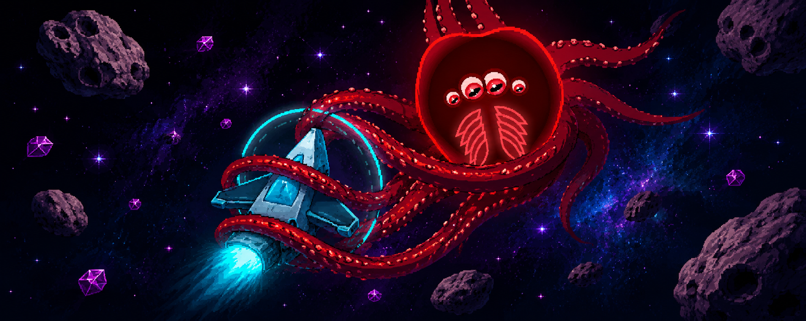
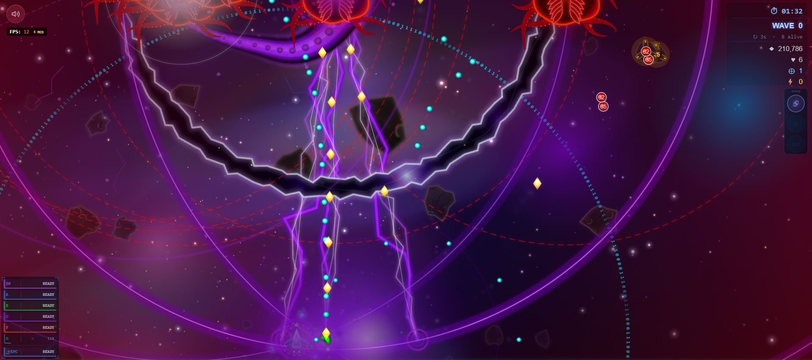

# Pisces: Space Journey

**Author:** An Nguyen

**License:** [MIT](LICENSE)

**Play the game:** [https://aansensei.dev/space-shooter/](https://aansensei.dev/space-shooter/)

A fast-paced arcade space shooter with deep combat mechanics, percentage-based damage scaling, and powerful screen-clearing abilities. Survive endless enemy waves, manage your cooldowns, and go for the highest score.

---

## How to Play

| Input | Action |
|---|---|
| ← → Arrow Keys | Move left / right |
| Spacebar (tap & hold) | Charge shot — release to fire |
| Spacebar (hold 3 seconds) | Overload Laser |
| Shift Left / Right | Skill: Yog-Sothoth Domain |
| A | Skill: Thunder Orbs |
| S | Skill: Remembrance Spirit / Primeval Creation |
| D | Skill: Death Star |
| F | Skill: Annihilation Sweep |
| G | Skill: Life Domain / Tesla Matrix |

- You start with **12 lives**. Earn **+1 life** every **500,000 points**.
- Your ship fires automatically at all times.
- A small **cyan hitbox dot** at the exact center of your ship shows the true collision point — only that dot touching a bullet costs a life.
- Enemy bullets always render on top of all effects and are outlined with a **pulsing white glow** so they remain visible in dense situations.
- The game automatically **pauses** if you switch tabs, and resumes cleanly with no time skips.

---

## General Combat Rules

**Damage Reduction (DR)** is a percentage of incoming damage that is negated before it is applied. All DR sources stack additively and are capped at **85%** for sustained enemy defense (**65%** for friendly summons) — two timed exceptions (Veilshroud's own 3s Phantom and its Goliath Joker copy, Leviathan's 1s post-shield-break grace) still reach 99%.

**Shields** are an HP buffer that absorbs incoming damage before the body's HP is touched. Shields can be stacked from multiple sources, but ordinary shields share an aggregate cap: **50% Max HP** for enemies, **30% Max HP** for allies (Goliath's own is stricter still, see its own passives below). Destroying a shield does not reduce the target's Max HP.

**Percentage damage** is calculated against the target's raw **Max HP** alone, never its current Shield — a big shield doesn't make percentage-based hits land harder. It still hits the shield first before reaching body HP, same as all other damage.

**True damage** bypasses all **Shields** and **Barriers** entirely and is applied directly to HP. It does not bypass Damage Reduction, per-hit damage caps, or Iron Body invulnerability.

**Evade** is a base stat shared by all enemy tiers that gives a percentage chance to completely negate any incoming hit (dodge, no damage dealt). It scales linearly from a minimum to a maximum over the first **3 minutes** of game time, then stays at maximum. When an evade procs, a light-blue flash appears on the enemy. Evade applies before all other damage resolution.

| Class | Evade (t=0 → t=3 min) |
|---|---|
| Normal | 1% → 2% |
| Abnormal | 3% → 5% |
| Elite | 5% → 10% |
| Dominator | 10% → 15% |
| Digiform (Goliath) | 40% → 25% over 15s post-transform, +10% (3.5s, non-stacking) per HP milestone crossed — see its own Evasion passive below, not this generic system |

**Iron Body** is a state of complete invulnerability — the target is immune to all damage from all sources, including base damage, percentage damage, true damage, Death Star, and Skill F. Iron Body is fundamentally different from high DR: it is absolute, not a reduction. Examples: Leviathan's All for One shield, the player inside Yog-Sothoth Domain.

**CC Immunity** means the target cannot be displaced or slowed by any crowd control effect — Death Star pull, Tesla Coil slow, Dimensional Rift slow, Orb Sacrifice slow. CC Immunity does not block damage. **Egregor** and **Dargruel** have permanent CC Immunity. **Goliath** (True Form, via Inevitable) also has permanent CC Immunity.

When **Glory for Justice** is active, all friendly damage is multiplied by **1.55×**. When **Accurate Parry** is active, all friendly damage is additionally multiplied by **1.25×** (stacks on top of Glory for Justice).

---

## Player Stats & Attacks

Every friendly damage number below (and every Sigil/Sentinel number elsewhere in this doc) is expressed as a percentage of the player's own **ATK** stat, not a flat number — that's what stays constant across rebalances, not the raw damage. ATK starts at a base value and grows two ways: **+3%/wave up to Wave 20** (plateaus at +57%), and a flat bonus per equipped Sigil (each of the 13 grants a different amount, roughly 2-12%, weighted toward how offense-focused its kit is).

**Auto-Fire** — Fires 5 bullets in a 45-degree spread every **135ms** (+20% vs base). Each bullet deals **15% ATK**. Bullet speed increased +20%. Each bullet independently rolls a **28% chance** to apply Vulnerability (Trọng Thương).

**Charged Shot** — Hold Space to charge for up to 1 second, then release. Each charge-unit deals **8% ATK + 0.6% of target's Max HP**, scaling up to **10×** (80% ATK + 6% Max HP) at full charge.

**Overload Laser** — Hold Space for a full **3 seconds** without releasing. Fires a continuous beam for **12 seconds** (9s cooldown after). Deals **40.25% ATK** per tick every 155ms (Mirror Laser sigil: +20%). Also pulls nearby enemies toward the beam.

---

## Passive Abilities

### Vulnerability (Trọng Thương)

A stacking debuff inflicted by all friendly attacks that progressively weakens enemies.

- **Application Chance:** Player auto-fire bullets each have a **28% chance** per hit. All other allied sources — Sentinels, Spirits, Skill A orbs, Death Star, Overload Laser, Chain Lightning, Tesla DoT, and all other damage sources — have a **15% chance**.
- **On Application — Shield Shred:** Instantly destroys **20% of the enemy's current Shield HP** (scales down as the shield depletes — it always shreds 20% of whatever shield HP remains at that moment).
- **Damage Amplification:** Each stack increases all incoming damage to that enemy by **+12%**. At maximum stacks (4 stacks) the enemy takes **+48% more damage** from all sources.
- **Stacking:** Caps at **4 stacks**. Applying a new stack fully **refreshes the 3-second duration**. All stacks are lost at once when the timer expires. When an enemy reaches all 4 stacks, for the next **2.5 seconds** every player-side hit still eats Shield/Barriers normally but gains additional bonus true damage on top, **decaying linearly from +30% down to +15%** of the hit's damage over the window. When the window ends, the enemy takes **57.5% ATK true damage** and its stacks reset to 0 (a fresh climb back to 4 is required to trigger another window). Goliath specifically also has a **5-second cooldown** between windows, starting only once the current window ends (not overlapping it).

---

### Glory for Justice

Activates automatically when **any of the following** is true:

- More than 4 enemies are on screen
- Any **Abnormal or higher** enemy is present (Veilshroud, Uriel, Thaelis, Raphael, Marchosias, Egregor, Dargruel, Leviathan, or Goliath)
- Skill G is active
- **Phōtokrystos** (Đại Tinh Linh Khởi Nguyên) is active

**While active:**

- All friendly damage ×**1.55** (player, sentinels, chain lightning, tesla DoT)
- Player and Sentinel fire rate ×**1.2**
- Spirit bullets (Skill S) move **30%** faster
- Attacks trigger **Chain Lightning** (150ms cooldown) that arcs to up to **8** nearby enemies for **50%** of the triggering hit's damage
- Chain Lightning hits have a **60% chance** to apply **Soul Reaver** for **2 seconds** — a debuff (marked by a crossed-swords icon) that reduces all healing and shielding the target receives by **40%**
- **Soul Devourer (Cắn nuốt linh hồn):** Every **0.35 seconds**, enemies with Soul Reaver take **6.9% ATK** as true damage (bypasses all shields)
- All active Sentinels gain **+25% Damage Reduction**

---

### Sentinels

A Sentinel spawns automatically every **4 enemy kills**. Maximum **12 Sentinels** at once — if the cap is hit, the weakest Sentinel self-destructs to make room.

Each enemy kill has a **30% chance** to grant an extra kill count — meaning a single kill can count as 2 toward the next Sentinel spawn. When a Sentinel spawns, it has a **36% chance** to be a **Fortified Sentinel** with **+50% Max HP**.

**Base stats:** 300–450 HP (scales up over the first 5 minutes) | **62.5ms fire interval** (+20% vs base) *(Fortified: 450–675 HP)*

- Loses **1 HP** every time it fires (recoil).
- Takes damage equal to the HP of any enemy bullet that hits it.
- Every **4th shot** is a Special Shot: homing, deals **5.75% ATK**, +12% speed, and **heals the firing Sentinel for 2 HP** on hit.

**Herd Mentality** — bonuses scale with how many Sentinels are alive:

| Count | Bonus | Glow |
|---|---|---|
| 1–4 | +30% Max HP → **389 HP total**, +10% bullet speed | Cyan |
| 5–11 | +20% fire rate, +10% damage, +10% Damage Reduction | Magenta |
| 12 | Every shot becomes a Special Shot | Gold |

All Sentinels have **5% base Damage Reduction** at all times (stacks with all other DR sources).

**Sentinel Parry** — While Glory for Justice is active, every hit a Sentinel receives has a **20% chance** to be completely negated (the damage is fully ignored). On a successful parry:

- A golden burst flares at the parrying Sentinel.
- **Counter-buff activates for 4 seconds** (same as Accurate Parry):
  - All friendly damage output ×**1.25** (stacks with Glory for Justice).
  - A golden aura appears around the player.
  - All Sentinels gain **+10% Damage Reduction** for 4 seconds (stacks with all other DR sources).
- Tesla DoT and Chain Lightning cannot trigger Sentinel Parry.

**Vanguard Network (Liên kết Vanguard)** — Activates automatically when **5 or more** Sentinels are alive (Magenta or Gold glow). All Sentinels are connected by energy threads and share incoming damage.

*Damage Dampening:* Incoming damage is reduced based on how many distinct sources hit the network within a 100ms window — **1–2 sources:** ×1.00 | **3–4:** ×0.84 | **5–6:** ×0.72 | **7–8:** ×0.62 | **9+:** ×0.52. Additionally, any single source that hits 3+ times within 200ms: hit 3 = ×0.62, hit 4+ = ×0.32.

*Damage Sharing (Option A):* Any hit directed at a Sentinel is intercepted by the network. **60%** of the dampened damage goes directly to the targeted Sentinel, while the remaining **40%** is split equally among all N Sentinels (including the target). Damage is absorbed by shield first then HP. Sentinels with Iron Body active are skipped.

*AoE Dampening (Layer 1 — Bộ Giảm Chấn):* The network tracks how many Sentinels a given source has already hit. Each source (a Perseverance sweep, a death laser, etc.) gets its own independent hit counter:

| Hit count from same source | Damage into network |
|---|---|
| 1st and 2nd Sentinel | 100% |
| 3rd Sentinel | 62% |
| 4th Sentinel onward | 32% |

A Perseverance sweep passing through 10 Sentinels only delivers the equivalent of ~4.9× a single hit's damage to the network, instead of 10×. Each distinct source resets after 200ms of inactivity.

*Fuse Protocol (Layer 2 — Cầu Chì Hy Sinh):* The network tracks total damage received over the last **0.5 seconds**. If this sum exceeds **26% of the combined Max HP of all Sentinels**, the fuse blows:

1. The **Sentinel with the lowest HP** is sacrificed — it explodes and fires its death projectiles normally.
2. All remaining Sentinels instantly receive **Iron Body for 1.25 seconds** — complete invulnerability, immune to all damage from all sources with no exceptions.
3. The Magenta/Gold glow flickers white rapidly during Iron Body.
4. The fuse cannot trigger again for **3 seconds**.

Iron Body from the Fuse Protocol protects against all damage sources including Perseverance true damage and Last Rites lasers — giving the formation time to survive the remainder of a sweep or AoE burst. The cost is always exactly 1 Sentinel.

Sentinels with Iron Body active are individually immune in all damage paths (dealDamage, Perseverance, Last Rites). Tesla DoT and Chain Lightning are excluded from AoE Dampening tracking — they do not consume hit counts.

**Gaia Protection** — Sentinel Max HP grows by wave milestone: **+5%** at Wave 2 · **+10%** at Wave 6 · **+15%** at Wave 10; then **+3% per wave** afterwards until the total bonus reaches **+60% cap**. Current HP scales proportionally with each increase. While **Glory for Justice** is active, every **8 seconds** (reduced to **5 seconds** after Wave 10) each Sentinel generates a **Gaia Barrier** equal to **20% of lost HP + 12% Max HP** — non-stacking (each pulse replaces the previous). Fires immediately upon GfJ activation. The Barrier absorbs incoming damage up to its own remaining pool (no fixed percentage passes through regardless of size). **True damage bypasses the Gaia Barrier entirely.** Does **not** count as Max HP. Displayed as a green crescent above the Sentinel with a dedicated HP bar.

**On death** — explodes into 10 scattered projectiles (0.23% ATK each, speed 8) and causes a brief screen shake.

---

### Final Defense & Last Stand

**Final Defense** is an automatic safety net with two hidden shields:

- **Player Shield** — completely absorbs the next hit that would cost a life, regardless of damage amount. Regenerates after **25 seconds**.
- **Boundary Shield** — absorbs 1 enemy that crosses the bottom boundary. Regenerates after **25 seconds**.

**Last Stand** — triggers once per game only. If the player takes a fatal hit on their **last life**, they survive. The player and all active Sentinels instantly gain an **Absolute Shield** — a one-hit shield that completely blocks the next incoming hit of any damage amount. This can only happen once per game.

**Hit absorption priority (highest to lowest):**

1. Yog-Sothoth Domain — Iron Body (complete immunity, + triggers Accurate Parry if a hit occurs)
2. Thunder Orb Sacrifice (yellow orb from Skill A)
3. Final Defense Player Shield
4. Last Stand Absolute Shield
5. Lose a life

---

### Yuuki — Will to Fight

A passive that builds momentum as the run progresses, rewarding survival deep into the game.

- **Trigger:** Starting at **Wave 8**, and every **2 waves** thereafter (Wave 8, 10, 12, …), all allied units permanently gain **+20% damage output**.
- **Cap:** Stacks additively until the total bonus reaches **+300%** (15 triggers, reached at Wave 36), after which it stays fixed.
- **Bonus target-Max-HP damage:** On its own separate schedule (every wave from Wave 6 through Wave 20), each tier also adds **+0.35% of the target's own Max HP** as flat bonus damage, maxing out at **+5.25% target Max HP** by Wave 20 — this part reaches its cap much earlier than the damage-multiplier bonus above, which keeps growing on its own pace out to Wave 36.
- **Scope:** Applies to all player and sentinel damage — auto-fire, charged shot, skills, spirits, chain lightning, tesla DoT, and all other sources processed through `dealDamage`.
- **Display:** Once active, shown in the HUD as **⚔ Yuuki +X%**.

---

## Active Skills

### Shift — Yog-Sothoth: Cursed Domain Expansion

**Cooldown:** scales with hold duration (using teleport forces max CD):

- Held < 2s, no teleport → **1.1s** (−90%)
- Held 2–5s, no teleport → **4.4s** (−60%)
- Held 5–7s, no teleport → **9.9s** (−10%)
- Held ≥ 7s or teleported → **9s** (max CD) | **Max duration:** 8s (auto-cancels)

Hold Shift to open a cursed domain. Everything on the battlefield — enemies, movement, all timers — slows to **15% of normal speed**. You enter **Iron Body** (complete invulnerability — no damage source can touch you) while the domain is active.

**All enemy bullets on screen are immediately destroyed** when the domain opens, and no new enemy bullets can exist while the domain is active.

While active, press **← or →** to teleport. The teleport range increases the longer you hold Shift (up to half the screen width). A ghost shadow shows where you'll land.

**Accurate Parry** — If an enemy attack reaches the player while the domain is active, it is automatically blocked. This triggers a powerful counter-buff lasting **4 seconds**:

- All friendly damage output increases by **+25%**.
- All active Sentinels gain **Iron Body for 1.25 seconds** (complete invulnerability).
- A golden aura appears around the player while the buff is active.
- **The buff persists even after the domain ends** — closing the domain early does not cancel Accurate Parry.

---

### A — Thunder Orbs: Celestial Thunderburst

**Cooldown:** 6s

Summons **20 homing energy orbs** (up to 80 total on screen). Each orb homes in on the nearest enemy and deals **23% ATK + 2% Max HP** on impact (27.6% ATK + 2% Max HP for the split-orb path, e.g. Libra's Astral Pierce below), plus an additional **11.5% ATK + 15% of the target's lost HP** (13.8% ATK + 18% lost HP, split path) as true damage, then shatters into **16 scattered projectiles** (0.9% ATK each) that fly outward in all directions.

**Dimensional Rift** — When a targeting orb hits an enemy and actually deals damage (not blocked by Iron Body, Absolute Shield, or Evade), a **50 px spatial rift zone** tears open at the impact point and lasts **3 seconds**. Enemies inside the zone:
- **−35% movement speed**
- Immediately receive **Soul Reaver + Soul Devourer DoT** (6.9% ATK every 0.35s, true damage — skips Embryo)
- Take **+25% incoming damage** from all sources
- Enemy bullets (`enemy_bullet*`) within **2.5× the radius** are pulled toward the center; any bullet reaching the inner core (radius × 0.45) is destroyed
- The DoT has a **20% chance per tick** to trigger a Chain Lightning arc to up to **8** nearby enemies within 150 px, each hit for 3.45% ATK (independent of Glory for Justice)

**Orb Sacrifice** — Up to 3 orbs glow yellow at any time. If the player takes a hit, one yellow orb is automatically consumed to completely absorb the damage (acts as an Absolute Shield for that single hit). When an orb is sacrificed, the attacker (excluding untargetable types: `enemy_bullet`, Abyssal Chain, Veilshroud Echo, and enemies in Coronation) is immediately cursed:
- Receives **Soul Reaver + Soul Devourer DoT** (6.9% ATK every 0.35s, true damage)
- **−25% movement speed** for **3 seconds**

**Blood Arrow (Libra sigil's SPEC buff)** — Skill A's cooldown is reduced by **2s** while Libra is equipped, and casting it works completely differently: instead of firing right away, each press banks 1 stack. Pressing it with no enemy on screen just adds another stack, with no cap on how many can pile up while waiting for a target to show up. The next press that lands with a target releases **every** banked stack at once — each stack fires its own volley of **5 arrows** after a **0.5s windup**:
- **1 big arrow** marks whichever enemy currently has the highest HP + shield total.
- **4 small arrows** each prefer a different enemy from every arrow already marked earlier in the same volley (weighted toward denser enemy clusters), only repeating a target once every enemy on screen has already been marked once.
- The big arrow **pierces all enemies** it passes through for **45% ATK**, then **explodes** on its own marked target for **60% ATK + 3.5% of the target's Max HP**, scaled up by the target's estimated damage reduction (up to **+60%** more against very tanky targets). The explosion is **true damage** — bypasses shield entirely.
- The 4 small arrows pierce for **27% ATK** and explode for **27% ATK + 2.5% of the target's Max HP** (same DR scaling as the big arrow applies) **plus a flat 3% of the target's already-lost HP** on top, but fly **20% faster**; the big arrow is **15% bigger** than the small ones. The explosion is **piercing damage, not true damage** — shield still absorbs it normally.
- Every pierce hit (from either arrow size, on any enemy that isn't its own marked target) is also piercing damage, never true damage.
- Every explosion applies **2 Vulnerability stacks**.
- **Anti-focus discount:** within a single volley, the first arrow (any of the 5) to hit a given enemy deals full damage — every hit after that on that *same* enemy deals **30% less**, whether it's a pierce hit or an explosion. Stops one juicy target standing in multiple arrows' path from eating 5 full hits.
- If an arrow's marked target dies during the 0.5s windup, the arrow still fires toward that target's last known position instead of the stack being wasted — it can still pierce-hit whatever else is standing there, it just won't get the explode-on-target bonus since nothing is left to explode on.
- Libra also reskins the base Thunder Orb kit itself: every orb (orbiting, homing, or piercing) is wrapped in a thin blood-red visual coating, trails ink-red instead of cyan/yellow while in flight, and leaves a spreading blood-pool splat on hit instead of the normal explosion — cosmetic only, none of the numbers above change. Dimensional Rift (below) is also reskinned into a small blood-flower garden while Libra is equipped.

**Astral Pierce (Libra sigil's ATK buff)** — Skill A orbs no longer stop at their target: on impact they punch straight through and keep flying to the screen edge, dealing **27.6% ATK + 2% Max HP** plus **13.8% ATK + 18% of the target's lost HP** as true damage to every enemy they cross (the split-orb path numbers from the Thunder Orbs section above). Orb size is also **+30%**.

---

### S — Remembrance Spirit: Summoned Spirit Judgment

**Cooldown:** 12s | Max 1 active Spirit

Summons a Spirit that orbits near you for **35 seconds**, firing homing bullets automatically every **54ms** (+20% vs base).

- **Spirit Bullet:** 13.8% ATK, homing, +10% flight speed bonus.
- **Blade Arc:** Every 5 shots, fires a wide sweeping arc (radius 125) dealing 20.7% ATK + 1.5% Max HP (24.8% ATK + 1.5% Max HP with the Twin Blades sigil).
- **Finale (at 35s):** The Spirit drifts to the screen center, charges for 2.5 seconds while firing continuous lasers (1.15% ATK per tick, true damage), then launches a single Spinner: 5-second lifetime, bounces off every screen edge (speed boost on launch and each bounce), 24% ATK + 1.5% Max HP true damage on contact (900ms cooldown per enemy, so it can re-hit the same target repeatedly over its life without doing it every single frame), and every 0.3s near an enemy slashes 4 mini Arc Blades in a cross pattern (41% ATK piercing each, 47% ATK with Twin Blades). Both the contact hit and the arc blades share one diminishing-returns rule: a repeat hit on a target within 1s of the last Spinner hit that landed on it deals 30% less.

---

**Passive: Primeval Creation**

Every time the Spirit (or its attacks) kills an enemy, it charges a **mana meter** displayed on the Skill S button: **+2% per spirit kill**, **+1.25% per kill from any other source**. At **100%**, press S again to transform the Spirit into **Phōtokrystos**. Cannot activate if the Spirit has already entered its Finale. The meter resets if the Spirit enters Finale without transformation.

Against any single enemy with **over 50,000 Max HP** (in practice, only Goliath True Form reaches this), the meter also charges from raw damage dealt: **+1.5% per 1% of that enemy's Max HP dealt as damage**, on top of the normal kill-based charging above.

---

### Phōtokrystos — Đại Tinh Linh Khởi Nguyên

Phōtokrystos replaces the normal Spirit when Primeval Creation activates. A summoning circle appears and the Spirit transforms. The 40-second duration begins on the **first attack** after transformation.

**Duration:** 40s (from first shot) | **Cooldown:** 12s (starts at summon, unlocks after BTM ends) | **Size:** +20% vs normal Spirit

**Normal Attack** — Every **42ms** (+20% fire rate), fires **3 homing bullets** all tracking the nearest targets: **14.4% ATK** each. All attacks destroy enemy bullets on contact, apply Glory×1.55 and Vulnerability (15% chance).

**Skill: Boomerang** — Every 6 volleys, throws **2 spinning boomerangs** that chain all enemies: **57.5% ATK + 2% Max HP (True Damage)** per hit. Any contact — even a glancing blow — deals damage (re-hittable every 200ms). Destroys enemy bullets along path. If no enemies are present when the volley triggers, the throw is queued (up to **5 pending**). Maximum **10 boomerangs** on screen simultaneously — if the cap is reached, the oldest active boomerang is recalled to make room. Instead of disappearing, boomerangs **fly back to Phōtokrystos** after 2 bounces or when their lifetime expires (return speed is **60% faster** than flight speed). Back to Motherland instantly recalls all active boomerangs.

**Passive: Danger? Not Today!** — Triggers when any enemy comes within **170px of the player** or within **170px of the bottom boundary**. Phōtokrystos halts all attacks and aims for **100ms**, continuously re-locking onto the nearest threatening enemy each frame. It then unleashes a **2-second primeval laser beam** that sweeps **±20°** around the locked angle — the beam extends to the screen edge and **instantly destroys every enemy it touches**, bypassing all shields, Iron Body, and invulnerability. Allies are unaffected. Each enemy killed by the beam produces a burst effect. After firing, Phōtokrystos suffers **−20% damage output for 3 seconds** from primeval energy exhaustion. The **10-second cooldown begins after the beam ends**.

**Companion Effect: Vine Bind** — The instant Danger? Not Today! locks on, Phōtokrystos also calls on the primeval forest: vines erupt from nothing to bind the enemy nearest the bottom boundary **and** the enemy nearest the player (the same enemy if it qualifies for both). Vines take **1 second** to fully grow in, then a **green aura** appears and the bound enemy(s) are slowed **50% for 2 seconds** — aura and slow end together. CC-immune enemies (Egregor, Dargruel, Leviathan, barrier-shielded Marchosias, invulnerable Raphael) are unaffected.

**Passive: Blessing of the Primordial** — While Phōtokrystos is active: all Sentinels' shot recoil HP cost is reduced by **15%**, all allied damage is boosted by **+15%**, all Sentinels regenerate **+1.5% Max HP every 0.75s**, and every **3 seconds** each Sentinel individually receives a **+4.6% ATK shield** (capped at 15% of that Sentinel's own Max HP).

**Skill: Back to Motherland (@37s from first shot)** — Phōtokrystos stops moving and activates a **full-screen lightning barrier** for **3.5 seconds**: a green energy field covers the entire screen, every enemy is struck by a lightning bolt every 100ms dealing **20 base + 35% Max HP (True Damage)**. All enemy bullets are destroyed each tick. After the barrier ends, Phōtokrystos fires a **final shockwave** sweeping the entire map (**10 base + 99% Max HP**, bypasses ALL shields/Iron Body, destroys all enemy bullets), then vanishes.

---

### D — Death Star: Draconic Annihilation (Tinh Vương Long: Tử Long Tinh)

**Cooldown:** 10s | **Charge:** 2s

After a 2-second charge, spawns a Death Star that pulls all enemies and enemy bullets toward its center at speed 5.25. Anything that touches it takes **999,999,999 damage** — instant kill, even through Absolute Shields.

- Embryos have **CC Immunity** — immune to the gravitational pull but still die at the center.
- **Egregor** and **Dargruel** are CC Immune — the Death Star cannot pull them. If they are at the center, they take **30% of their Max HP as true damage** instead of instant kill.
- The Death Star slowly floats upward and disappears off-screen.

**Mark & Annihilate** — Every ~2 seconds while the Death Star is alive, it marks 3 targets (CC-Immune enemies first, since those can't be pulled to the center at all; otherwise the 3 highest-current-HP valid targets). After a 1.5s telegraph, it fires a **piercing true-damage beam** through each marked target and on to the screen edge — **100 base + 15% Max HP**, hitting every enemy the beam crosses, not just the marked one.

**Galactic Spaceships** — Every enemy the Death Star kills (center instakill, a Mark & Annihilate beam, or an accumulated CC-Immune tick finally finishing one off) reduces Skill D's own cooldown by **0.25s**. Separately, any enemy that dies for any reason — killed by an ally, the player, or the Death Star itself — while within **the Death Star's radius + 180px** spawns an allied spaceship (Tier 1, cyan). Each spaceship homes toward the current highest-HP enemy on screen, firing a **fixed 100 true damage** bolt every 250ms while in flight, then on contact deals **100 + 8% Max HP true damage** and applies **1 stack of Vulnerability**. Spaceships have **560 HP** and can be shot down by enemy fire before reaching their target.

**Fusion** — Two same-tier spaceships within 50px of each other merge into one higher-tier ship at their midpoint. Two Tier 1s fuse into a **Tier 2 (purple)** with all stats ×1.5 (840 HP, 150 true dmg bolt, 150+12% Max HP on contact). Two Tier 2s fuse into a **Tier 3 (red)**, all Tier 2 stats ×2 (1,680 HP, 300 true dmg bolt, 300+24% Max HP on contact) — the maximum tier.

---

### F — Annihilation Sweep: Thiên Ý Trảm

**Cooldown:** 7s | **Charge:** 1.5s | **Sweep:** 1s

Charges up, then sweeps a massive plasma beam across the entire screen. Every enemy in the sweep path takes **999,999,999 damage** — instant kill, even through Absolute Shields.

---

### G — Life Domain / Tesla Matrix: Sinh Mệnh Kết Giới

**Charge:** fills +0.5% per enemy kill | **Duration:** 30s

Activates Glory for Justice immediately. Spawns Energy Orbs at enemy kill locations throughout the duration.

**Energy Links** — Orbs automatically pair up and connect. Enemies passing through the link slow down by 8% and take **8% ATK** damage every 250ms (Circuit Engineer sigil: +30%). Chain Lightning's jump from a link tick deals 8% ATK.

**Tesla Coils** — After 5 seconds, each linked pair of orbs merges into a Tesla Coil (max 4 total). Each coil has a radius-200 aura that slows enemies and strips **5% DR and 100 flat DR** from them (a target with less than that to lose takes the shortfall as bonus damage: 5% per missing DR point, 1:1 for flat). Every ~0.42 seconds (0.5s with a +20% fire rate) each coil picks up to **5 different enemies** inside the aura, charges for ~0.08 seconds, then fires a homing bolt at each one, ~0.08 seconds apart, for **20% ATK piercing** damage (Circuit Engineer sigil: +30%). A bolt that lands also **slows** its target 32% for 1.5 seconds (a fixed strength that only refreshes the timer, never stacks; CC-immune enemies ignore it). Each enemy takes at most one bolt per volley, and bolts do not trigger Glory for Justice's Chain Lightning. Coils have no health. Instead every bolt a coil fires adds one **stack** (max 5, each lasting 1.5s on its own timer), shown as a 5-cell bar above the coil. Each stack adds **+5% fire rate** to that coil and **+2% ATK** to every bolt hit, all cumulative. Once the coil holds 5 stacks, its next bolt is **empowered**: it deals an extra **10% ATK plus 5% of the target's lost HP plus 1% of the target's Max HP**, roots the target for **0.5s**, and resets the stacks to 1 (the empowered bolt counts as the first stack of the next cycle). Enemy bullets no longer hurt a coil, and each enemy bullet that flies into an aura has a **25% chance to vanish** (rolled once per bullet), on top of being slowed. When several coils slow the same enemy (overlapping auras or bolts from different coils), the first slow lands in full and each extra coil's slow is **40% less effective**. A coil that has fired 500 bolts self-destructs.

**Detonation** — When a coil's HP (30) runs out or the 30-second duration ends, all orbs and coils explode. Each coil blast deals **2.3% ATK** in a large area (Circuit Engineer sigil: +30%).

---

## Sigils

Every wave 5 and wave 10, a sigil-pick screen offers 4 random choices from the full pool; picking one grants **both** of its buffs permanently for the rest of the run, and that sigil cannot be offered again. Twelve entries in the pool are tied to the Western zodiac signs (Aries through Pisces). **Great Sage** is the first entry of a separate, planned "Vietnamese Zodiac" (12 con giáp) set, drawn from its own pool alongside the zodiac signs rather than replacing any of them. Element: Earth (its 72 Transformations map to the 72 Earthly Fiends of Chinese numerology, not to any metal).

### Great Sage — Đấu Chiến Thắng Phật

Reskins **Annihilation Sweep (Skill F)** into Sun Wukong's own Ruyi Jingu Bang (Như Ý Kim Cô Bổng), with its own charge-up visuals, a Kim Cô binding-ring lock-on in place of the base skill's cyan reticle, its own title card (鬥戰勝佛 / VICTORIOUS FIGHTING BUDDHA / Đấu Chiến Thắng Phật), and a commissioned gold gem-slot frame hovering above the ship. Players without this sigil see zero change to Skill F.

Every real cast of Annihilation Sweep also phases the player and every sentinel out for 1 second: untargetable and immune to all damage, fading and shedding smoke wisps, the same rule as Veilshroud's own ghost.

**Ransacked Treasury (SPEC)**
- Within a single sweep, the staff's width grows with every kill it lands during that cast, not with elapsed time, up to **4.5x** its starting width, resetting at the start of each new cast.
- Killing an **Elite-tier-or-higher** enemy (Thaelis, Raphael, Egregor, Marchosias, Veilshroud, Dargruel, or Leviathan; Apostle kills never count) by **any** means, not just a Skill F sweep kill, immediately steals that enemy's own **gem**, one of each kind, up to **3 held at once**. A duplicate of a gem already held is not collected. Gems never decay on their own.
- **Goliath is the exception:** since it's already made of 3 other bosses' stolen powers, killing it steals all **3** of the gems it currently holds (whichever 3 abilities its own Joker system absorbed) in one go, instead of a single generic gem.
- Pressing Skill F at any time with at least 1 gem held spends the **oldest** gem first: it fires a scaled-down copy of that enemy's own signature attack (see table below) without touching Skill F's own charge/cooldown cycle at all, since the sweep already clears most of the screen on its own. A center-screen prompt appears the whole time at least 1 gem is banked.

**72 Transformations (ATK)**
- Every Skill F press still spends exactly **1** gem (oldest first), never more. While **3 different** gems are held at the same time, though, the one being spent hits **1.65x** as hard - a passive reward for staying topped up, not a separate all-3-at-once trigger.

**Stolen attacks, by gem** — each one reuses the real joker attack's own render code (`_drawGoliathJokerEffects` and friends, `js/render/enemy-goliath.js`) recolored blue instead of the gem's own color, so the visual is a faithful copy of Goliath's own version, not an approximation. Values below are expressed as a percentage of the player's own ATK stat (so they stay readable across future rebalances instead of a single number computed at one specific baseline) and are at 1x strength; 72 Transformations multiplies each by 1.65x.

| Gem | Real joker attack | Stolen copy |
|---|---|---|
| Thaelis | Persistent damage reduction | Player: 1 Iron Body layer that blocks the next hit outright. Sentinels: a 3s window of 50% dodge chance per hit instead. |
| Raphael | Marks up to 3 lines (player + 2 more), 1s telegraph, fires straight along each | Marks lines toward 3 locked points (nearest enemy + 2 more enemies, or random on-screen points if there aren't enough), 0.5s telegraph, fires along each fixed line: 33% ATK + 3.5% Max HP per line to everything still on it (Lumen Nova). |
| Marchosias | 1s windup, throws a sword at each of 3 locked points (player + 2 more), piercing | 0.5s windup (the launch point tracks the player live, only the 3 target points - nearest enemy + 2 more, or random points if not enough - are locked at cast time), throws a real piercing blade (reuses the Blade Arc projectile) toward each: 39% ATK + 3.5% Max HP each (Arc Barrier). |
| Veilshroud | Marks 3 positions (player + 2 more), 1.5s delay, lightning strikes each spot only if something is still there | Marks 3 locked points (nearest enemy + 2 more, or random points if not enough), 0.75s delay, a bolt strikes each spot, only damaging whatever is still standing there: 48% ATK + 3.5% Max HP true damage per bolt (Phantom Strike). |
| Egregor | Windup tracking the target, then a 180° tentacle-whip slash reaching however far the target is | 0.5s windup that keeps tracking the player's position and the current nearest enemy the whole time (locking only the instant it fires), then a real 180° arc slash centered on the player reaching up to the full screen diagonal: 39% ATK + 3.5% Max HP (Null Slash). |
| Dargruel | An expanding shockwave ring covering the full screen (`spawnBossShockwave`), clearing enemy bullets in its path before damaging what's left, not an instant flat hit | An expanding ring covering the full screen diagonal over 0.7s: wipes any enemy bullet it passes through outright, and damages every other enemy the instant it passes through them: 28.4% ATK + 3.5% Max HP (Root Shockwave). |
| Leviathan | 1.5s warning, then one full 360° rotation of a sweeping beam | 0.3s warning, then one full 360° rotation around the player over 0.9s at full screen range: 30% ATK + 3.5% Max HP (Perseverance Sweep). |
| Goliath | 3s channel, locks aim, fires a piercing orb | 0.6s channel that keeps tracking the player's position and the current toughest enemy the whole time (locking only at launch), then fires a real piercing **true damage** orb (reuses the Blade Arc projectile) straight through every enemy in its path: 63% ATK + 2.5% Max HP, applying 1 Vulnerability stack and a 2.5s Soul Reaver curse to each one it pierces (Absolute Verdict), real judgment against foes tough enough to shrug off one hit, Goliath's own Warding Palm and Inevitable DR chief among them. |

---

## Enemies

*All enemies have a hidden +15% HP bonus applied to their base stats.*

---

### Apostles (Normal)

Spawns continuously from the start. HP starts between **22–42** and scales up over time (capped at **330 HP**). Fires 1 bullet per second — the bullet's HP equals the enemy's HP at the moment of firing.

**Score on kill:** HP × 6 points

**Passive: Coronation (Đăng Cơ)** — Each Apostle on screen has a chance every second to undergo a transformation into a higher-tier enemy:

- **Above the midscreen line**: **0.67% per second** base chance.
- **Below the midscreen line**: **1% per second** base chance.
- **Death bonus**: Each Apostle that dies normally adds **+0.67%** (above midline) or **+1%** (below) to all remaining Apostles' base chance — cumulative. Resets to 0 when a Coronation triggers.
- **Global limit**: At most **3 Coronations** can trigger within any 5-second window.
- When triggered, the Apostle undergoes a ≈2.2s animation. During this time: it is **slowed 45%**, **immortal** (immune to all damage), and **untargetable** (cannot be selected by Sentinels, Skill A, or any player mechanic).
- After the animation ends, the Apostle is consumed and replaced by a higher-tier enemy — always **Marchosias**, **Thaelis**, or **Dargruel**; can also be **Veilshroud**, **Egregor**, or **Leviathan** if their respective caps allow. No wave restriction applies. The spawned enemy starts with full HP and a **1-hit Iron Body** (blocks exactly one hit from any source).
- Coronation transformations do not grant kill score.

---

### Veilshroud (Abnormal)

**Available after:** Wave 2 | **Spawn rate:** 12% → 25% | **Cap:** 2 on screen | **Score on kill:** HP × 6 points | **Speed:** 2.0 u/s

HP: **1,320–3,300**. Innate **40% Damage Reduction**.

A shifting entity that phases in and out of reality to avoid damage and punish careless positioning.

**Passive — Void Echo (Phantom Portal)** — On death, leaves an **untargetable, immortal Phantom Portal** at the death position. When Veilshroud enters this form, the wave system counts it as dead, so the wave can progress without waiting for the portal to collapse.

- **Seconds 0–3:** the portal births **real Apostles**, 2 every **600ms** (~10 total). Each is telegraphed by a dark patch at its spawn spot for 450ms before it forms. Apostle HP = `max(60, ceil(0.30 × total damage this Veilshroud took while in Phantom over its lifetime))`. Portal Apostles move **20% slower** than a normal wave Apostle.
- **Second 5:** the portal **collapses**. White core flash, screen shake, and every ally-side projectile (bullets and Arc Blades) within **345px** is erased. A Player inside 345px at the instant of collapse loses **1 life** (the normal save stack still applies: Dream Realm, Great Sage, Yog-Sothoth, Skill A's orb, Final Defense).
- The collapse leaves a **2-second** damage zone (345px, ticks every 500ms, 4 ticks): **Sentinels take 6% Max HP per tick**; the Player takes no life loss from the zone, only from the collapse itself.
- The portal is fully immune to all damage and CC for its whole lifetime.

**Normal Attack** — Fires **2 bullets** every **500ms** at the nearest target. Disabled while in Phantom or during a Void Strike countdown.

**Skill: Alteration — Phase Shift & Void Strike** — A combined passive skill with two linked effects:

- Every **0.45 seconds**, has a **40% chance** to enter **Phantom** state for **1.5 seconds**: **99% DR**, movement and attacks stop. Additionally, while in Phantom, **no single hit can exceed 25% of Veilshroud's Max HP** (absolute damage cap on top of the 99% DR). Healing and shields received by Veilshroud are also **reduced by 25%** while in Phantom.
- Every incoming hit has an additional **40% chance** to instantly trigger Phantom (the hit is completely negated).
- On Phantom exit, marks a random Sentinel or Player with a **red targeting reticle**. After a **1.5-second countdown**, a **red lightning bolt** strikes: Player = **1 life lost** (protections apply); Sentinels within **100px** = **18% Max HP** damage.
- **In normal state only**: incoming healing also grants equal **shield**; incoming shield is boosted by **+20%**. Neither bonus applies while in Phantom. Receiving healing in normal state also grants **+10% DR for 3 seconds**.

**Passive: Energy Accumulation** — While in **Phantom** state, Veilshroud records all damage it absorbs. On Phantom exit, the accumulated absorption is converted into a shield: **min(1200, ⌈(35% × absorbed + 200) × 1.15⌉)**. The base 200 guarantees a minimum shield of **230** even if no damage was absorbed. Resets each time Phantom is entered.

---

### Uriel (Abnormal)

**Cap:** 1 on screen | **Spawn cooldown:** 5s between spawns | **Never spawns on a Goliath wave** (wave number divisible by 5)

HP: **1,725–4,140**. Innate **40% Damage Reduction**, and every hit is separately hard-capped at **30% of Max HP** regardless of DR.

A herald-boss that never attacks the player directly. It patrols the **upper half of the arena only** and never descends past mid-screen, shields the whole horde, and answers every broken ward with a Holy Sword.

**Passive: Covenant King** — Refreshes its own **1-hit Iron Body** every 2 seconds. Every 1 second, scans and grants **every other living enemy** on screen **infinite CC Immunity** plus a **Uriel Iron Body layer** (re-granted every 5 seconds per enemy once consumed). Consuming one of these layers fully negates that hit and feeds a shared counter: **every consumption** tries to trigger Camouflage; **every 3rd consumption** tries to fire a Holy Sword. If that scan goes over **3 seconds** without finding another living enemy to buff, Uriel stops sitting idle and fires a Holy Sword on its own every **1.5 seconds** instead. Uriel itself is immune to every DOT source and every debuff (Vulnerability, Soul Reaver, slows, root, silence).

**Passive: Against Chaos** — Starts at **99% evade**. Every hit that actually lands permanently knocks it down **5%**, floored at **30%** (never recovers). Each successful dodge also stacks a 1-second **+5% move speed** bonus, capped **+40% total**.

**Passive: Protection** — On death, leaves a **stationary barrier** at the death spot for **4 seconds**, **1.2×** its own body diameter wide. Blocks and cannot be pierced by normal bullets (deleted on contact), piercing projectiles (stopped), Skill F's sweep, Skill D's core (which simply waits at the barrier instead of passing through, never consumed), and the Overload Laser (which now visually stops at the barrier's edge instead of just having its damage occluded). It is never a valid target for any ally. Vanishes after 4 seconds, at which point the rest of the horde also loses Covenant King's CC Immunity and any unspent Uriel Iron Body layer.

**Skill: Judgment (Holy Sword)** — Can only actually fire while Uriel is visible; a trigger during Camouflage is banked and auto-released the instant it's free again. **0.5-second charge-up** (energy converges into the core, wings flare), then launches straight toward the player's position **from 100ms ago** (not the live position) at roughly **806px/s**, piercing along its line. On hitting the player: normal life loss through the usual save stack, plus **Judged** (3 seconds: any further hit costs 1 extra life, net −2). On hitting a Sentinel: **30% Max HP true damage**, and the sword keeps flying afterward.

**Skill: Camouflage** — Triggers every time a Uriel Iron Body layer is consumed anywhere, or after **10 hits** land directly on Uriel itself (a safety net for when there's nothing else around to consume a granted layer), on a **3-second cooldown** measured from the moment the previous stealth ends. **1.75 seconds** fully invisible, untargetable, absolute Iron Body, regenerating **1.5% Max HP per second** the whole time. On reappearing, Uriel teleports to a fresh random point in the upper half of the arena (same margin its normal patrol waypoints use) with a **15% Max HP shield** plus **200 flat DR for 2 seconds**.

---

### Thaelis (Abnormal)

**Available after:** Wave 2 | **Spawn rate:** 12% → 25% | **Cap:** 2 on screen | **Score on kill:** HP × 6 points | **Speed:** 1.4 u/s

HP: **1,265–2,640**.

Fires **2 large projectiles** every second. After 0.6 seconds of flight each splits into **6 smaller homing bullets**. Small bullets deal 1 life of damage to the player, or **15% Max HP** to a Sentinel.

**Skill: Tenacity** — A passive scaling skill that activates as Thaelis loses HP:

- For every **1% of Max HP lost**, Thaelis gains **+1% Damage Reduction** on its body. Capped at **60% total DR** from this source.
- For every **0.5% of Max HP lost**, Thaelis's projectile speed increases by **+3.5%**. Capped at **+25%**.
- No single hit can exceed **max(35%, 90% − 5% × HP% lost) × MaxHP** damage (scales down as HP is chipped away).
- Every time Thaelis loses **30% of its Max HP** (at 70%, 40%, and 10% HP thresholds), it generates a **Shield** worth **20% MaxHP + 10% HP lost + 100**: it must be fully destroyed before any damage (normal or piercing) reaches Thaelis's body. Displayed as a pulsing gold ring. The sole exception is **Spirit Laser**, which bypasses it; even true damage from other sources must destroy the Shield first.

**Reincarnation:** At 0 HP, Thaelis collapses into an untargetable **Cocoon**.

- The Cocoon itself carries no HP and cannot be hit directly: it's **CC Immune**, has an absolute **Iron Body**, and cannot receive outside heals or shields. It's guarded by **4 Guards** at all times, each with **500–1,000 flat HP** (not tied to Thaelis's own Max HP), the same evade chance as Thaelis's own tier, **40% + 20 flat Damage Reduction**, and full immunity to every DoT source in the game.
- Killing a Guard doesn't damage the Cocoon directly. It banks a flat **150 Shield** (carried over to Thaelis if it revives, capped at 30% of its revived Max HP, see below) and counts toward a random **12–16 kill quota** rolled fresh each time, shown live as a number on the Cocoon's body. A dead Guard is replaced after **1 second**.
- Meeting the kill quota within the **9-second** timer destroys the Cocoon for good, killing Thaelis. Falling short, Thaelis climbs back out at **40% of its original Max HP** plus whatever Shield was banked, with **1 second of invulnerability**, a **12-second cooldown** before it can trigger Reincarnation again if it dies again right away, and three permanent Reincarnation buffs: **+100% Max HP** (so effectively 80% of its original Max HP), **+10% DR**, and **+100 flat DR** on top of its usual Tenacity scaling.

---

### Heavenly Raphael (Elite)

**Available after:** Wave 2 | **Spawn rate:** 6% → 14% | **Cap:** 2 on screen | **Score on kill:** HP × 6 points | **Speed:** 1.65 u/s

HP: **2,376–4,118**. Permanent **50% Damage Reduction** at all times.

**Custos Aeternus** — Spawns with an **Iron Body shield**: the **first 20 hits** it receives from any source — including Death Stars and Skill F — are completely nullified. Each hit triggers a white flash, and hit-counting is throttled to at most 1 per ~175ms so a single burst of near-simultaneous attacks (e.g. Skill A's Thunder Orbs) can't blow through the whole pool in one cast. After the 20th hit the shield breaks and Raphael takes damage normally. **While Custos is active, Raphael is CC Immune** — immune to Death Star pull, Tesla slow, Dimensional Rift slow, and Orb slow — and takes **zero damage from any DoT tick** (Tesla Coil, Dimensional Rift's Soul Devourer, Solar Flare, Yog-Sothoth's tick, Soul Reaver) while the shield is up, sparking a small cyan flicker instead of counting toward the 20. After Iron Body expires, **Support Aura gains +35% heal efficiency** permanently for the rest of the encounter. When Custos breaks, Raphael also gets a one-time Shield based on how many allies were inside its aura at that moment: 0 allies → +8% Max HP, 1 ally → +10%, 2 → +15%, 3 → +20%, 4+ → +25%.

**Support Aura** — Constantly emits a field covering half the screen width:

- Heals all ally units inside for **4% of Raphael's Max HP per second, capped at 3% of the recipient's own Max HP per second** (×1.35 after Custos expires; Raphael itself heals at 55% efficiency). Cannot heal units at 0 HP.
- Grants every allied unit inside a shield every second, capped at **min(2% of Raphael's Max HP, 2% of the recipient's own Max HP)** (passive tick — stacks on top of the one-time shield below; units with any remaining shield also benefit from the +12% DR bonus).
- Grants a **shield** equal to **min(20% of Raphael's Max HP, 25% of the recipient's own Max HP)** to all allies inside (once per ally). Shielded units gain **+12% Damage Reduction** while the shield has any HP remaining.
- If a heal exceeds the target's Max HP, the overflow becomes a shield at 25% efficiency.
- All enemies and enemy bullets inside move 5% faster.

**Lumen Nova** — Every 5 seconds, marks the player and 3 random Sentinels with targeting lines. After 1 second, fires fast lasers along those paths. Hitting the player costs 1 life (or consumes a protective layer). Hitting a Sentinel deals **20% of its Max HP**.

**Wisdom King** — Raphael's title backed by a real mechanic, split across two states:

- **Custos Aeternus still up:** every hit that lands on Raphael (including DoT ticks that Custos otherwise no-sells) builds a hidden tally. Every **80 hits**, Raphael gathers for ~0.65 seconds — a seam of light cracking open with a ring of its own etched glyphs spinning inward — then launches a piercing **Wisdom Orb**. The orb doesn't fire in a fixed or random direction: it picks whichever straight line out of Raphael threatens the most targets at once (Sentinels plus the player), with a tie-break bonus for a line that also catches the player. It accelerates as it flies and pierces everything on that line — **Sentinel hit:** **25% of its Max HP as piercing true damage**, plus a scorched zone left behind that deals **5% of the Sentinel's Max HP per second for 1.5 seconds** and slows anything standing in it by **25%**. **Player hit:** costs **1 life** and applies a **50% movement slow for 1 second**.
- **Custos Aeternus broken:** Raphael's evade is replaced entirely by a flat **20%**, boosted to **25%** specifically against player, Sentinel, and spirit/Photokrystos fire.

---

### Marchosias (Elite)

**Available after:** Wave 2 | **Spawn rate:** 5% → 13% | **Cap:** 2 on screen | **Score on kill:** HP × 6 points | **Speed:** ~1.6 u/s

HP: **2,112–4,092**. Permanent **45% Damage Reduction** on its body at all times.

**Sword & Barrier**

Marchosias carries a rotating **Arc Barrier** — a glowing 90-degree arc that continuously tracks and faces the player. The barrier and Marchosias's body HP are **completely independent pools**, each equal to Marchosias's Max HP at spawn.

*Barrier properties:*

- **60% Damage Reduction** on all incoming damage to the barrier. No single hit can exceed **35% of the barrier's current HP**.
- **Completely buff-immune:** the barrier cannot receive heals, DR boosts, Raphael shields, or any other beneficial effect.
- While the arc barrier is alive, Marchosias and the barrier gain **+10% evade** (applies to both body hits and barrier hits).
- **Piercing attacks** (Spirit Arc Blade, Boomerang, Overload Laser) that connect with the barrier first: body damage is reduced **−30%**, the barrier takes **+15% extra damage**, and the attack continues through. **True damage** bypasses the Arc Barrier entirely and hits the body directly. All other attacks are fully absorbed by the barrier.
- **Lifesteal per hit:** each hit on the barrier heals the barrier for **5% of damage dealt** (max 1000 HP); Marchosias's body heals for **10% of damage dealt** (max 1000 HP, overflow → **50% converted to shield** on Marchosias's body).
- **Barrier break:** when the barrier's HP reaches 0, Marchosias immediately gains a **5-hit Iron Body**, gains **+20% DR**, heals **40% Max HP** (overflow → 50% shield), and gains a **shield equal to 15% Max HP + 15% of HP lost**. The **+20% DR is removed** when the barrier revives. Revive time depends on sword cycle: if all 4 swords were used before the barrier breaks → burst explosion animation, fixed **3-second** revive; otherwise **4–5 seconds** (5s at start, scaling to 4s at 3 min).
- **Tracking speed** scales from ×1.0 at match start up to **×1.67 at 3 minutes** of play.

*Sword trigger conditions:*

- Every barrier hit or **evaded hit** has a **25% independent chance** to queue a Sword.
- If the barrier is fully destroyed, a Sword is queued immediately.
- When Marchosias's body HP drops to **1%**, all queued Swords fire simultaneously (spread slightly apart). The count is displayed as Roman numerals below Marchosias at all times (dim dot when none are queued).

Each Marchosias can trigger a **maximum of 4 Swords per barrier cycle** — the counter resets each time the barrier revives. Two Roman numeral counters are displayed below Marchosias at all times: **green** shows the active sword queue, **gold (I→IV)** shows how many cycle swords have been used — glows bright gold at IV to signal that the next barrier break will use the 3-second revive. Each Marchosias has its own independent **0.65-second cooldown** between triggers. Multiple queued Swords count down their 1-second windups in parallel and fire independently. **Swords cannot be interrupted** — even if Marchosias dies mid-windup, all pending Swords still fire from the death position.

*Sword sequence:*

1. A static orange warning beam extends from Marchosias to **your position at the moment of trigger** for 1 second.
2. After 1 second, an orange arc projectile (radius 88) launches along that exact line. It does not home.
3. Hits the player → all normal protective layers apply (Orb Sacrifice → Final Defense → Last Stand → lose a life).
4. Hits a Sentinel → deals **27%** of that Sentinel's Max HP on the 1st hit, **23%** on the 2nd, **21%** on the 3rd and beyond.
5. **Cannot be destroyed or deflected by anything.** Persists until it exits the screen.

**Normal Attack**

Every second, fires **2 bullets** simultaneously at the nearest player or Sentinel. Each bullet's HP equals ⌈1.25% of Marchosias's current HP⌉.

**Assimilation — Death Passive**

At 0 HP, explodes and spawns **3 Minion Robots**, each inheriting **25–35%** of Marchosias's Max HP at random, then boosted by a further **+30%**. Each minion has **75% innate Damage Reduction**, and no single hit can exceed **50% of its max Max HP**.

Each minion scans within **170px** for a valid host (excluding other Marchosias):

**Host found → Parasite Mode:** Attaches as a **Parasite Shield** — absorbs damage before all other shields, including Raphael shields. Completely buff-immune: no heals, no regeneration, no DR bonuses can affect it. A green rotating ring marks infected hosts.

**No host nearby → Hunt Mode:** Charges the player at **+55% speed**, firing bullets and dealing contact damage. During hunt mode the minion rescans every 500ms — if a valid host enters range, it attaches immediately. Minions flash a glowing ring to signal their presence in the bullet chaos.

---

### Egregor (Elite)

**Available after:** Wave 2 | **Spawn rate:** 3% → 12% | **Cap:** 1 on screen | **Score on kill:** HP × 6 points | **Speed:** 1.5 u/s

HP: **2,112–4,620**. Permanent **40% Damage Reduction** on its body at all times. **Permanent CC Immunity** — immune to all crowd control including Tesla slow, Dimensional Rift slow, Orb Sacrifice slow, and Death Star pull. A massive psychic entity with 10 waving tentacles, an organic pulsing body, and 4 eyes that track the player at all times. Descends toward the player, then holds position in the upper screen while cycling between Null Slash and Psychic Tempest.

**Passive: Collective Mind** — Egregor has **10 independent tentacles**, each with their own HP pool equal to **78% of Egregor's current MaxHP**. Every non-true-damage, non-piercing hit triggers a tentacle interception roll: the **deflect chance scales with alive tentacles** (alive/10 × 60% — 60% at full strength, declining as tentacles are destroyed); on a miss, the hit is absorbed by one tentacle at **35% × 75% DR** (net ~26% of the original hit). **When a tentacle dies:** Egregor's body **heals 6% MaxHP**, **MaxHP increases by 20% of that tentacle's HP**, and the body gains **+5% DR** (cumulative, max +20% at 4 losses). Once **≥1 tentacle is lost**, normal attacks (and all non-piercing, non-true sources) also **bleed through to the body** after tentacle interception at **15% of their damage**, hard-capped at **15% MaxHP** per hit. When all 10 tentacles are dead, normal attacks deal **50% damage, capped at 30% MaxHP**. Egregor's body can also be damaged by **true damage** (capped at **max(25%, 90% − 10% × n)% MaxHP** per hit) or **piercing attacks** (tentacle takes 26% of hit, body takes **30% of original damage**, capped at **30% MaxHP**). Egregor cannot coexist with Veilshroud on the field.

**Passive: Mind Link** — Each time a non-Egregor enemy dies within **600px**, Egregor gains a **Rage Stack** (max 5 active at once, each lasting 8 seconds). A pulsing red dashed ring marks the 600px range. Per stack gained: **+18% movement speed**, **+15% Max HP**, **Heal 15% of current MaxHP**, all alive tentacles are **healed 15% of their max HP** and gain **+5% DR** (stacks additively, max +25% at 5 stacks). Gaining a Rage Stack immediately triggers a Psychic Tempest cast (if not already casting). Rage stacks are shown as red stars around Egregor's body.

**Skill: Psychic Tempest** (CD 4s, 15% faster with any rage) — Selects up to **3 random targets** from the player and active Sentinels. Target positions are **locked at the moment of cast** — the bolts do not track movement. After a **1.2-second telegraph** (shrinking impact ring + converging sparks + warning thread from Egregor), all selected targets are struck simultaneously by psychic lightning from Egregor's original position. The strike hits within **100px radius**: costs **1 player life** or deals **20% of Sentinel MaxHP** per hit. If Egregor dies during the telegraph phase, the bolts still fire.

**Skill: Null Slash** (CD 3.5s between strikes) — Egregor locks onto the player and begins a windup of **1–3 seconds** (base 3s no rage / 2.5s with any rage, reduced by 0.25s per stack, minimum 1s). During the windup Egregor continues moving forward, tracks the player live, and gains **+35% DR**. At release, the target position is locked and a giant tentacle arc sweeps a **180° semicircle** toward that point. Anything inside the arc is hit: **Player** — no life lost, movement slowed **50% for 1.5s** (visible purple ring + falling particles; Yog-Sothoth dodges — still no life loss). **Sentinels** — **20% MaxHP true damage** (1 hit) / **30% MaxHP** (2 hits) / **40% MaxHP** (3+ hits), rage bonus **+6% per stack** up to **+30%**. After the sweep, a **Dimension Break** zone (glowing purple arc) lingers on the slash path for **1 second** — moving through it slows the player an additional **20%**.

**Passive: Boon and Bane** — Throughout the entire Null Slash windup (charging phase), every body hit Egregor receives grants it a **Barrier equal to 75% of that damage**. This barrier accumulates and absorbs subsequent non-true-damage hits before they reach Egregor's body HP. True damage pierces the Boon and Bane barrier. The total barrier accumulated is tracked throughout the full windup. **Immediately when the Null Slash fires**, Egregor deals **self-inflicted true damage equal to 50% of the total accumulated barrier**, bypassing its own Damage Reduction and per-hit caps, hard-capped at **40% of its Max HP**. This is a pure self-damage that cannot be influenced by the player. The barrier and accumulation counter reset to zero after each Null Slash cycle.

---

### Dargruel (Dominator)

**Available after:** Wave 3 | **Spawn rate:** 4% → 13% | **Cap:** 1 on screen | **Score on kill:** HP × 6 points | **Speed:** ~1.6 u/s

HP: **6,200–16,000**. DR is fully dynamic — see Passive below. **Permanent CC Immunity** — immune to all crowd control including Tesla slow, Dimensional Rift slow, Orb Sacrifice slow, and Death Star pull.

**Demon Gift** — Triggers when HP crosses **90%, 70%, 50%, 30%, and 1%**:

- Heals all other enemies for **28% of Dargruel's Max HP**. Enemies with Soul Reaver receive only 75% of this heal. Overflow converts to a shield at 30% efficiency. Cannot heal enemies at 0 HP. Affected enemies emit a **purple flame aura** for 4 seconds.
- All units gain **+20% Damage Reduction for 4 seconds**, stacking up to 2 times (max **+40%**).
- Dargruel gains **+3 Iron Body hits** per trigger.

**Passive: Inevitable** — Dargruel's innate damage mitigation:

- When any single hit would exceed **25% of Dargruel's Max HP** (after DR), activates a **3.5-second protection window**: all damage is capped at **11% of Max HP per hit**. The protection has a **2-second cooldown** before it can activate again.
- For every **6% of Max HP lost**, Dargruel gains **+5% evasion** (capped at **+30%** from this mechanic).

**Passive: Maître Suprême** — Dargruel's Damage Reduction scales dynamically with Sentinels:

- **50% base DR** at all times.
- **+2.5% DR per active Sentinel** on screen. Capped at **60% total DR**.
- **+5% normal attack speed per active Sentinel**, capped at **+20%**.

**Skill: Abyssal Chains (Xiềng xích hắc ám)** — Every **2.1 seconds**, fires **4 dark chains** (−10% speed vs prior) in a fan aimed at the player. Chains are **piercing** — immune to all player and ally attacks: bullets, Skill A orbs, Skill F sweep, Death Star, Yog-Sothoth Domain, spirit blade arcs, spirit finale, Overload Laser, and Tesla DoT. Chains cannot be targeted by Skill A or Sentinel AI.

- **Normal chain — Hit player** → **Root & Silence for 1 second** (no life loss). The chain is **not consumed** by the player hit — it continues and can also hit a Sentinel simultaneously. Re-applies silence even if already silenced.
- **Normal chain — Hit Sentinel** → **true damage equal to 15% of that Sentinel's Max HP**, chain consumed on contact.
- **Darkened chain** — each volley has an **18% base chance** for one random chain to be darkened (black-red visuals). Chance increases **+2% per clean volley** without a darkened chain, resetting to 18% when one fires. Darkened chain — **Hit player**: costs **1 life** (no root/silence). **Hit Sentinel**: **20% Max HP true damage**.
- **On death at HP = 1**: immediately fires one extra volley of 4 chains.

**Maou Haki** — Triggers once at **50% HP**:

- Fires a screen-wide purple shockwave that instantly destroys all player and ally projectiles. The anti-bullet zone lingers for **0.5 seconds** after the sweep completes.
- Any Sentinel hit loses **38% of its Max HP**.

---

### Leviathan (Dominator)

**Available after:** Wave 3 | **Spawn rate:** 2% → 6% | **Cap:** 1 on screen | **Respawn cooldown:** 8s after kill | **Score on kill:** HP × 6 points | **Speed:** ~1.5 u/s

HP: **8,820–15,435**. A massive armored entity with 9 segmented wing-plates surrounding a black-hole core with a living eye that tracks the player at all times.

**Passive: Inevitable** — Leviathan's core resilience mechanics:

- **60% base Damage Reduction** at all times (active once the All for One shield breaks).
- When any single hit would exceed **20% of Leviathan's Max HP** (after DR), activates a **3-second protection window**: all damage is capped at **10% of Max HP per hit**. The protection has a **2-second cooldown** after the window ends before it can activate again.
- The instant Leviathan's HP first crosses **50%**, this protection window activates immediately and unconditionally — regardless of the triggering hit's size or the normal cooldown. This can only happen once per Leviathan.
- Leviathan's own bullets destroy **player auto bullets**, **Sentinel bullets**, and **both Remembrance Spirit and Phōtokrystos bullets** on contact — even ones that would normally pierce straight through. No other friendly projectile types are affected.

**Passive: Bulwark Barrier**

Every **1 second**, if its shield has not yet reached the cap, Leviathan gains a shield layer worth **0.5% of Max HP × the number of enemies currently on screen** (each layer individually capped at **15% of Max HP**), up to **2 layers stacked** (~30% of Max HP total). Once the shield is fully depleted, the layer count resets and it builds back up from scratch.

The instant the **All for One** shield breaks, Leviathan additionally gains a one-time barrier worth **50% of Max HP** and **90% Damage Reduction for 1 second** — a grace period covering the vulnerable transition out of Iron Body.

**Passive: Herd Leader (Thủ Lĩnh Bầy Đàn)**

When Leviathan appears, every enemy on screen instantly receives the **Envy** mark — visible as a red pulsing ring. Envy is re-applied every **2.5 seconds** to catch enemies that spawn after Leviathan. Envy is permanent on each target and cannot be removed:

- **+25% Damage Reduction** (stacks with all other DR, hard-capped at 99%).
- **+25% effectiveness from all healing sources**.
- **+1% Max HP regeneration per second** (continuous, cannot exceed Max HP).

**Passive: All for One**

Leviathan spawns with a secret **kill quota Y** (10–20). Until that many enemies are killed, Leviathan is encased in an **Iron Body shield** — every damage source deals absolutely zero damage. Not reduced — zero. The shield is displayed as a glowing sphere; the wing-plates fold inward while it is active.

When Leviathan spawns (including via Coronation), the game immediately checks if enough killable enemies exist to satisfy the quota. If not, it spawns the missing number of Apostles at once, so the shield can always be broken.

Every attack that lands on the shield counts as a **hit** (capped at 250). Displayed as `X/Y kills` and `N/250 hits` below Leviathan. While shielded, Leviathan has **CC Immunity** — immune to Death Star pull and Tesla slow.

When the quota is reached, Leviathan charges a **Perseverance sweep** (red warning + full 360° laser), then the shield shatters and combat begins.

**Passive: Last Rites**

When Leviathan's HP reaches **1** — by any source, including Death Star and Skill F — Last Rites triggers. Each of its 9 wing-plates rotates to aim at a specific target (sentinels and the player) over **1 second**, projecting a warning beam as it turns — a power-surge band now travels along each wing toward the tip as it charges, with crackling sparks once nearly ready. All 9 lasers then fire simultaneously (layered void-purple/red/white-hot beams with a shockwave ring at the origin), reaching the edge of the screen and remaining active for **0.9 seconds**. These lasers are independent objects that persist even after Leviathan is removed.

- Hitting the player costs **1 life** (subject to normal protection layers).
- Hitting a Sentinel deals **true damage**: **3% of that Sentinel's Max HP × (AFO shield hits ÷ 2) per laser**, capped at **55% of Max HP** (the cap is reached at 37 shield hits).

**Normal Attack**

Always active. Every **0.75 seconds**, fires 3 bullets in a slight spread at the nearest player or Sentinel. Each bullet's HP equals **2% of Leviathan's Max HP**.

**Skill: Perseverance**

Leviathan's only active attack. It fires automatically after the **All for One** shield breaks (as a combat opener) and again whenever triggered by other mechanics.

1. A full red warning ring appears around Leviathan for **1 second**.
2. A **360° laser** sweeps the entire screen, starting from a fixed angle and completing a full rotation. The sweep lasts approximately **1.5 seconds**.
3. The laser deals true damage to everything it crosses: hitting the player costs **1 life** (subject to normal protection layers); hitting a Sentinel deals **5% of that Sentinel's Max HP × AFO shield hits per tick**, capped at **50% of Max HP** (the cap is reached at 10 shield hits).
4. The sweep cannot be blocked, deflected, or avoided by Yog-Sothoth Domain.

---

### Goliath (Digiform)

**Availability:** every wave that's a multiple of 5 (5, 10, 15, 20...), once per such wave. A testbed boss for the future Administrator class. | **Cap:** 1 on screen | **Speed:** 0 (does not move under normal physics; positions itself)

Goliath exists in three phases: **Alpha** (a dormant, invulnerable seed that feeds on the rest of the wave), **Transition** (a 4-stage transform sequence), and **True Form** (the actual boss fight).

**Phase: Alpha**

Spawns near the top of the screen at **1 HP**, absolutely invulnerable and fully untargetable — no exception of any kind applies during this phase.

- **Circuit Link:** the instant it spawns (and continuously afterward, to catch anything spawned later), Goliath links to every other enemy currently on screen. Any hit that would land on a linked enemy is capped at **80% of that enemy's own Max HP**, with the difference redirected into Goliath's **Damage Pull** ledger instead of being lost — this is what determines True Form's eventual Max HP.
- **Corrupted Genesis:** when a linked Abnormal-tier-or-higher enemy dies, a colored gem (matching one of 7 possible enemy types) drops at the death location and flies in a curved arc into one of Alpha's 3 open sockets — landing triggers a slight shockwave shake on Alpha's body. Filling all 3 sockets with 3 *distinct* gem colors begins Transition. Any gem that arrives too late for an open socket (a duplicate color, or one still in flight the instant the 3rd distinct socket fills) isn't wasted: once True Form finishes forming, it's redirected to the nearest living enemy as a one-time shield worth 20% of that enemy's own Max HP.
- **Feeding Ground (passive):** the instant Goliath spawns, `ceil(current enemy count / 3)` of the wave's current enemies are consumed outright (with a death-burst effect), and every enemy that survives the culling gains **+15% Max HP**.

**Transition**

A 4-stage, ~4-second transform sequence: meteors converge on Alpha from all directions and fuse into a molten mass (Summon), the mass swells and bubbles as everything melds together (Fusion), it cools and crystallizes into the True Form body with the 3 absorbed gems igniting in sequence (Crystallize), then both arms extend and settle into place with a final shockwave ring (Settle). Goliath remains invulnerable and untargetable throughout.

On completion, True Form's Max HP is set to `(65000 + min(damagePull, 320000)) × (1 + 0.25 × gemPoints) × Walpurgis's Max HP multiplier × 1.40`.

**Passive: Inevitable**

- **4-second absolute Iron Body** immediately upon successfully transforming into True Form — no exceptions, not even piercing or true damage.
- **63% base Damage Reduction** at all times (decayed further by Waning Might, see below).
- **Permanent CC Immunity** and **0.75% of its True-Form-entry Max HP ("Hentry") regeneration per second**, drawn from a shared repeatable heal budget rather than an unbounded tick.
- When any single hit would exceed **8% of Max HP** (after DR), activates a **2-second protection window**: all further damage during the window is capped at **2.5% of Max HP per hit** (0.5-second cooldown after the window ends).
- Regular %Max HP-scaling damage — including the player's and sentinels' basic auto-fire — is hard-capped at **1.3% of Max HP per hit** (still subject to DR), **+0.3% per stack** of any debuff currently on Goliath — Vulnerability stacks, Soul Reaver, any active slow (including Electromagnetic Field), Venom stacks, Yog-Sothoth's mark, standing inside a Dimensional Rift, Leo's Burn stacks, or standing in a Tesla Coil's aura — capped at **3% of Max HP total**. **Piercing, true damage, and DoT hits are not unbounded either** — they get their own separate, higher per-hit cap: **3.5% of Max HP** (still subject to DR), **+0.3% per debuff stack**, capped at **6% of Max HP total**. This second cap is what governs Tesla/Leo/Aquarius/Soul-Reaver-style DoT ticks specifically, the most continuous of the sustained damage sources. Since Goliath is otherwise CC-immune, these debuff-stack bonuses are effectively the only way sigils can meaningfully punish it beyond raw damage. Neither cap affects Skill F, Skill D, or the Phōtokrystos finale laser, which have their own Warding Palm rule below.
- **Shield Burst:** tracks *actual HP+shield loss* (not raw incoming damage — true damage that bypasses shield only counts its HP portion) within a rolling 1-second window. The instant that total exceeds **12% of Hentry**, Goliath gains a new **Shield** worth **20% of the damage accumulated in that window, capped at 8% of Hentry**, then immediately consumes up to **10% of Hentry** worth of its *current* Shield and converts **50%** of whatever was consumed into a heal. **3-second cooldown** between triggers; the damage window resets the instant it fires.

**Passive: Fracture Step**

Teleports away whenever a threat (player ship or a player bullet) closes within **100px**, or automatically every **2 seconds** regardless (2-second cooldown on the teleport action itself). Each teleport grants **+1 layer of Iron Body**, absorbing the next **3 hits** completely. The teleport itself is a deliberately slow, telegraphed transition — not an instant blink: a magic-circle portal closes over the old position (~400ms), then opens at the new position (~400ms), with the body fading out and back in to match.

For **1 second** after arriving, Goliath gains **+20% damage dealt**, **+10% flight speed**, and **+15% effectiveness on all heal/shield it receives** (stacks with Thaelis's own +35%, if copied).

**Passive: Unbroken Will**

Triggers exactly **once** per Goliath: the first hit that would otherwise kill it is negated entirely instead. Goliath becomes fully invulnerable for **4 seconds** (the same absolute Iron Body rule as the post-transform window — no exceptions), is revived to a **full 100% of its Max HP**, and immediately gains a Barrier layer worth **15% of its entry Max HP (Hentry)**. For the following **6 seconds**, starting the instant the 4-second invulnerability ends (not overlapping it): **+20% effectiveness on all heal/shield it receives** (stacks with everything else), **+10% of Hentry as Max HP** (granted as real, usable HP, reverted automatically when the window ends), and **+15% flight speed** — the body visibly flickers for the duration as a tell. On top of that, once Unbroken Will has triggered, Goliath permanently keeps an extra **+12% Damage Reduction**, **+250 flat armor**, and **+10% evade** for the rest of the fight — the second phase is meant to be a genuine full second fight, not a weakened continuation. The instant the 4-second invulnerability ends, Goliath releases an orange shockwave identical in mechanics to Maou Haki (same speed, radius, and screen-wide bullet-clearing behavior) — but this wave deals **no damage and costs no lives** to anyone; it's a pure release of the pent-up invulnerability, telegraphed by a brief casting flash on Goliath's body.

**Passive: Absolute Verdict**

A self-cast channeled attack, not a reaction. Every time it comes off cooldown: both arms clasp together at Goliath's eye for a **3-second channel**, tracking the player's live position — but only until **0.5 seconds before it fires**, at which point the aim locks and no longer follows. On completion, a piercing orb launches from the eye along the locked direction: **35% of Max HP as true damage** to a Sentinel it hits, or **-5 lives** to the player. Hitting the player also **silences them for 1.25 seconds** (see Root & Silence below — no root here, silence only). 8-second cooldown after firing.

**Skill: Corrupted Meteor**

CD **4s**. Goliath raises a hand and pulls up to **3 random living Apostles** at once (fewer if fewer are available) into a compressed meteor core over **0.8 seconds**, consuming each one as fuel, then throws **more meteors than Apostles consumed**: 1 Apostle → 3 meteors, 2 → 4, 3 → 5 (the maximum), all in a fan spread — any extra meteors beyond the Apostles actually consumed are "empty" (no fuel, same as the zero-Apostle case). If no Apostle is available to pull, it still throws exactly **1** empty meteor (never a no-op). Hitting the player costs **1 life** and **silences them for 0.75 seconds** (no root) per meteor; hitting a Sentinel explodes for **25% of that Sentinel's own Max HP** as splash damage to nearby Sentinels.

**Passive: Warding Palm**

Incoming hits specifically from **Skill F**, **Skill D**'s center pull-kill (the Death Star's Mark & Annihilate beams and its spaceships' damage are unaffected — only the center-contact hit itself), or the **Phōtokrystos finale laser** are simply too powerful to ever be fully negated. Each hit has a **35% chance** to be deflected, taking only **10% of Max HP**; the other **65% of the time** it lands for **22% of Max HP**. This is per hit, with no lifetime cap. This rule, like every other Goliath-specific rule, takes priority over any sigil that would otherwise bypass Iron Body or trigger an unconditional instakill (e.g. Death Mark's ≤5%-HP lightning instakill, or its Skill F Iron-Body-piercing effect) — Goliath cannot die to those regardless of sigil. Landing a Skill F hit against Goliath through Warding Palm also refunds **1.5 seconds** off Skill F's own cooldown, whether the hit was deflected or not (otherwise the fight is little more than waiting out Skill F's full cooldown 3+ times in a row).

Separately, **all damage from Phōtokrystos itself** (its homing bullets and its boomerang) is reduced **40%** against Goliath — applied before Damage Reduction and before Inevitable's per-hit cap, so it reduces both the capped normal-type hits and the uncapped true-damage boomerang alike.

**Passive: Threshold Ward**

Starts True Form at **40% evade**, decaying linearly down to **30%** over the first **15 seconds**, then holding there for the rest of the fight — evade applies against everything except Skill F, Skill D's center pull-kill, and the Phōtokrystos finale laser, which bypass it entirely via Warding Palm's own return path above.

On top of the base evade, crossing each of the **75%, 50%, and 25%** HP milestones (downward) does two things at once: a **one-time** (never re-triggers) **15% of Hentry** shield grant, and a **+10% evade bump for 3.5 seconds** that, unlike the shield, can retrigger any number of times over the fight (healing back above a milestone and dropping through it again re-fires it), though it never stacks past a single +10% layer no matter how many milestones are crossed at once.

**Passive: Unified Front**

Every 1 second, recounts every living player-side unit on the map right now (the player always counts as 1, plus every real Sentinel, plus the Remembrance Spirit if summoned — Yuusha Party squad members deliberately don't count, since their attacks already eat the heavier of the two flat-armor brackets in this section) and refreshes 3 defensive stats off that count (N), rather than compounding tick over tick:

- **Flat armor:** `180 × (1 + 5% × min(N, 12))` — subtracted after the % DR above, same shared flat-armor pool Tempered Resolve (below) and Walpurgis add into.
- **Healing/shield effectiveness:** `+2% per ally, capped at +20%` — stacks with every other heal/shield bonus Goliath has.
- **Shield top-up:** every second, grants a Shield worth `0.25% of Hentry × min(N, 8)`, drawn from the shared shield budget.

**Passive: Weaken on Hit**

Any Goliath damage that actually lands on the player — body attacks, Absolute Verdict, Corrupted Meteor, any Joker copy — cuts their ATK by **30% for 1.5 seconds**. Getting hit again while it's still active just refreshes the window; it never stacks deeper or lasts longer than 1.5 seconds from the most recent hit.

**Passive: Waning Might**

Every **35 seconds** spent in True Form, Goliath grows weaker across 3 axes at once — base Damage Reduction, its own heal/shield effectiveness, and the damage its own attacks deal — each multiplied down (not subtracted, so none of them can go negative) rather than capped, ensuring a fight that drags on long enough always winds down instead of grinding forever at full strength. The first 2 stacks decay at a plain per-stack rate; every stack past that squares the rate instead, so a fight still going by the 3rd stack (135+ seconds in True Form) falls apart noticeably faster than the first two stacks alone would suggest. Goliath starts at 0 stacks and only begins decaying after the first 35-second mark.

**Passive: Casting Restriction / Tempered Resolve**

While channeling any skill — its own Absolute Verdict, or any Joker-copied ability below — Goliath is **35% slower**, cannot use Fracture Step, and gains **+10% Damage Reduction** plus a separate **+300 flat armor** (Tempered Resolve, on top of Unified Front's own flat armor below) for the duration. Separately, a **Cast-end recovery** triggers the instant a cast actually ends (not when it begins): a heal worth **3% of Hentry**, drawn from the shared heal budget, on its own **4-second cooldown** shared across every cast.

**Skill: Joker System**

True Form gains working, independently-cooldown copies of exactly the **3 abilities** tied to the 3 gems it absorbed during Alpha (out of 7 possible). Each copy is rebalanced to fit a boss and re-telegraphed against its own timing/size — not a flat, one-size-fits-all approximation. Every copy below that actually lands on the player also **silences them for 0.75 seconds** (no root), same rule as Absolute Verdict and Corrupted Meteor above:

- **Veilshroud — Phantom + Lightning:** randomly (~50% chance per 450ms once off cooldown) enters a 3s Phantom (+99% DR). On exit, locks 3 points (the player plus 2 Sentinels, or random on-screen positions filling in for any Sentinel the fight doesn't have), telegraphs for 1.5s, then strikes each: the player takes a `playerTakesHit()` hit (dodgeable if it's moved out of the marked spot), Sentinels take **5% Max HP true damage**.
- **Thaelis — Tenacity:** `max(10%, 25% − 0.15% × %HP lost)` DR — starts at 25% DR at full HP and decays down to a 10% floor as Goliath takes damage, the opposite direction of the real Thaelis's own Tenacity (which gains DR as it loses HP). On top of that, +20% effectiveness on **every** heal/shield Goliath receives from any source (stacks additively with everything else — Inevitable regen, Unified Front, Fracture Step, Unbroken Will), and every **5% of Max HP** lost (a fresh 5%-bracket, never re-triggers the same bracket twice) heals **0.75% of Hentry** (lifetime cap 15% of Hentry from this source) and grants **0.5% of Hentry** as shield (lifetime cap 10% of Hentry).
- **Raphael — Lumen Nova:** every 4s, marks 3 fixed targeting lines (chosen once, not re-tracked) toward the player plus 2 Sentinels, or random on-screen positions filling in for any Sentinel the fight doesn't have, telegraphs 1s, then fires along each line. Player hit → `playerTakesHit()`. Sentinel hit → **25% Max HP true damage**.
- **Marchosias — Sword & Barrier (full port):** a separate **8000 HP barrier** (fixed value, not scaled to Goliath's own Max HP) absorbs incoming hits before they reach the body — 60% DR on the barrier itself, no single hit exceeding 35% of the barrier's *current* HP, 10% flat evade per hit (also on a miss), piercing hits get +15% extra barrier damage but pass through to the body at −30%, true damage bypasses the barrier entirely. Every hit landed on the barrier heals it 5% of the damage dealt (cap 2000) and heals Goliath's body 10% of that damage (cap 2000, overflow above Max HP → 50% converted to shield), and has a **25% chance** (10% on an evaded hit) to queue a Sword strike — up to **10** per barrier cycle, 650ms between triggers, each trigger throwing 3 swords (1000ms windup each) at the player plus 2 more locked points (Sentinels, or random on-screen positions filling in for any Sentinel the fight doesn't have): costs the player 1 life per sword that hits, and Sentinels caught in a sword's path (it pierces through, not destroyed on a Sentinel hit) take **27% / 23% / 21% Max HP** for the 1st / 2nd / 3rd-and-later Sentinel it hits — the same formula the real Marchosias's blades use. Reaching the 10th sword self-detonates the barrier immediately, same as running it down to 0 HP. When the barrier breaks: +5-hit Iron Body, heal 40% Max HP (overflow → 50% shield), +shield worth 15% Max HP + 15% of HP lost, and +20% DR until the barrier revives. Revive takes a fixed 3s if all 10 swords fired before the break, otherwise 4–5s (scaling faster later in the match). Note: unlike the real Marchosias, Goliath's barrier has no facing direction — it absorbs from every angle, since most damage sources reaching it carry no positional data to check against.
- **Egregor — Null Slash (not Psychic Tempest):** a 3s windup tracking the player continuously, locking angle and target at release. At the 460ms mark of the strike, sweeps a 180° arc: the player is slowed 50% for 1.5s (no life lost, dodgeable through Yog-Sothoth Domain), and every Sentinel caught in the arc takes true damage scaled by how many were hit at once (30% / 35% / 40% of their Max HP for 1 / 2 / 3+ hit). At 720ms, opens a Dimension Break zone (the same shared world-object system the real Egregor uses). 3.5s cooldown after. Visually, this is **not** Egregor's real tentacle — the arm itself stretches out into a long orange plasma/slime tendril (matching Goliath's own material) that sweeps through the arc, rather than a dark octopus tentacle or a bare fist.
- **Dargruel — Maou Haki:** every 8s, a screen-wide shockwave clears player projectiles in range and slows the player 30% for 2s if within range.
- **Leviathan — Perseverance:** 1.5s warning, then a 360° sweep over 1.8s. The player takes one `playerTakesHit()` hit per full rotation if caught in the beam. Every Sentinel caught in the beam also takes true damage each rotation, using the real formula (`min(50% Max HP, 5% Max HP × stacks)`) with a fixed 150 stacks in place of Leviathan's own AFO-shield-hit counter — since that always exceeds the real formula's 10-stack saturation point, this Sentinel tick always lands at the full 50% Max HP cap, matching a Leviathan whose AFO shield broke long ago.

**Movement**

True Form drifts slowly and continuously across most of the screen (biased toward the upper area, staying away from the bottom edge) rather than holding a fixed position — it only ever holds still during Fracture Step's portal transition or while Veilshroud's Phantom (if copied) is active. It always renders above the Sigil HUD so it is never visually obscured while flying near the top of the screen.

---

## Enemy Class System

Enemies are divided into six tiers of power.

| Class | Examples |
|---|---|
| **Normal** | Apostles |
| **Abnormal** | Thaelis, Veilshroud |
| **Elite** | Marchosias, Heavenly Raphael, Egregor |
| **Dominator** | Dargruel, Leviathan |
| **Digiform** (testbed) | Goliath |
| **Administrator** | Kanade of the Endless Nights |

**Cap (individual, on-screen simultaneously):** Marchosias 2 · Veilshroud 2 · Thaelis 3 · Raphael 2 · Egregor 1 · Dargruel 2 · Leviathan 1 · Goliath 1 (spawns once on every wave 5/10/15/20...). A single wave can have more of a given type than its cap — new ones simply wait until a slot opens. There is no combined cap across tiers.

---

## Spawn System

Enemies spawn in **waves**. Each wave defines an exact count per tier — all queued enemies are guaranteed to spawn within a **15-second spawning window**.

**Wave flow:**

- **Spawning phase (15s):** Apostles mix singles (62%) and bursts of 2–4 (38%). Higher-tier enemies are spaced proportionally across the 15s window. The HUD shows a pulsing `◉ X enemies` indicator while active.
- **Clear condition:** If all enemies are dead while the queue is empty, the wave ends after **3 seconds** ("WAVE CLEARED"). If enemies are still alive 12 seconds after the queue empties, the wave force-ends after a 1-second delay.
- **Rest phase (4s):** A countdown announces the next wave number before it begins.

**Wave templates (repeats from wave 9 onward):**

| Wave | Apostles | Abnormals | Elites | Dominators | Goliath |
|---|---|---|---|---|---|
| 1 | 32 | — | — | — | — |
| 2 | 38 | 6 | 4 | — | — |
| 3 | 40 | 7 | 6 | 2 | — |
| 4 | 44 | 8 | 7 | 3 | — |
| 5 | 48 | 9 | 8 | 4 | 1 |
| 6 | 52 | 11 | 9 | 5 | — |
| 7 | 56 | 12 | 10 | 6 | — |
| 8 | 60 | 13 | 11 | 7 | — |
| 9 | 64 | 14 | 12 | 8 | — |
| 10+ | +5/wave | +1/wave | +1/wave | +1/wave | 1 every 5th wave |

Within each tier, enemies are chosen randomly from the pool: **Abnormals** (Marchosias, Veilshroud), **Elites** (Thaelis, Raphael, Egregor), **Dominators** (Dargruel, Leviathan). Individual on-screen caps apply; there is no combined cap. **Goliath** (Digiform) spawns exactly once, outside every other tier, on any wave number divisible by 5.

### Walpurgis (Huyết Dạ)

Every **5 waves**, all enemies permanently gain **1 stack** of Walpurgis (the buff never expires or resets; wave 5 = 1 stack, wave 10 = 2 stacks, and so on). Each stack grants, to **every enemy on the field, including ones already spawned**:

- **+20% Max HP**: pushed the hardest of the four on purpose, since this game's real death clock is lives lost to contact, not raw damage taken, so a longer time-to-kill matters far more than a harder-hitting enemy would. Stacks forever, no cap.
- **+5% Evade**, capped at **+40%** from Walpurgis alone (8 stacks' worth) so a very long run never makes enemies outright unhittable; every other stat here keeps stacking past that point.
- **+25 flat damage reduction**: a separate stat from the percentage-based DR above, subtracting a flat amount from each hit *after* percentage DR is applied, floored at 0 (never blocks a killing blow outright, only shaves a fixed amount off each hit). Stacks forever, no cap.
- **+5% effectiveness on all healing and shields the enemy receives**. Stacks forever, no cap.

Enemies already on screen when a new stack triggers are rescaled immediately, not just future spawns. A red glow aura appears around every enemy once at least 1 stack is active, growing more intense with each additional stack.

---

## Administrator Class

### Kanade of the Endless Nights

*— Undefined —*

An Administrator-class entity exists beyond reality and governs it as a system rather than living within it. She created the Endless Nights Protocol to endlessly replicate universes and timelines, preventing all forms of finality and turning existence into an infinite chain of rewritten outcomes. With absolute control over causality, she can duplicate, overwrite, and define reality itself, yet she remains a distant overseer driven by the fear of an irreversible end. However, the emergence of Irregulars, entities beyond her authority, introduces a flaw in her perfect system and threatens the endless continuity she maintains.
