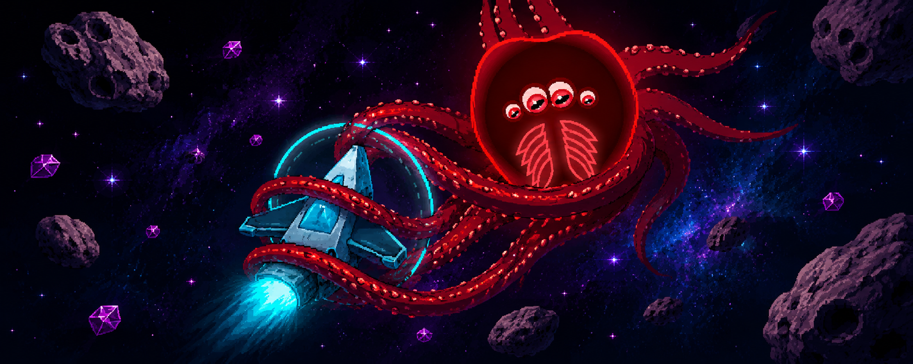

# Pisces: Space Journey

**Author:** An Nguyen

**Play the game:** [https://aansensei.github.io/space-shooter/](https://aansensei.github.io/space-shooter/)

A fast-paced arcade space shooter with deep combat mechanics, percentage-based damage scaling, and powerful screen-clearing abilities. Survive endless enemy waves, manage your cooldowns, and go for the highest score.

---

## How to Play

| Input | Action |
|---|---|
| ← → Arrow Keys | Move left / right |
| Spacebar (tap & hold) | Charge shot — release to fire |
| Spacebar (hold 3 seconds) | Overload Laser |
| Shift Left / Right | Skill: Yog-Sothoth Domain |
| A | Skill: Thunder Orbs |
| S | Skill: Remembrance Spirit / Primeval Creation |
| D | Skill: Cosmic Black Hole |
| F | Skill: Annihilation Sweep |
| G | Skill: Life Domain / Tesla Matrix |

- You start with **12 lives**. Earn **+1 life** every **500,000 points**.
- Your ship fires automatically at all times.
- A small **cyan hitbox dot** at the exact center of your ship shows the true collision point — only that dot touching a bullet costs a life.
- Enemy bullets always render on top of all effects and are outlined with a **pulsing white glow** so they remain visible in dense situations.
- The game automatically **pauses** if you switch tabs, and resumes cleanly with no time skips.

---

## General Combat Rules

**Damage Reduction (DR)** is a percentage of incoming damage that is negated before it is applied. All DR sources stack additively and are hard-capped at **99%** — nothing is ever completely immune to damage through DR alone.

**Shields** are an HP buffer that absorbs incoming damage before the body's HP is touched. Shields can be stacked from multiple sources. Destroying a shield does not reduce the target's Max HP.

**EP (Existence Point)** = Shield HP + Max HP. This is the base for all percentage-based damage scaling. EP reflects a sentinel's total existence — both its protective layer and its body. Max HP alone refers only to the body HP without shield.

**Percentage damage** is calculated against the target's EP (Shield + Max HP). It hits the shield first before reaching body HP like all other damage.

**True damage** bypasses all **Shields** and **Barriers** entirely and is applied directly to HP. It does not bypass Damage Reduction, per-hit damage caps, or Iron Body invulnerability.

**Evade** is a base stat shared by all enemy tiers that gives a percentage chance to completely negate any incoming hit (dodge, no damage dealt). It scales linearly from a minimum to a maximum over the first **3 minutes** of game time, then stays at maximum. When an evade procs, a light-blue flash appears on the enemy. Evade applies before all other damage resolution.

| Class | Evade (t=0 → t=3 min) |
|---|---|
| Normal | 1% → 2% |
| Abnormal | 3% → 5% |
| Elite | 5% → 10% |
| Dominator | 10% → 15% |

**Iron Body** is a state of complete invulnerability — the target is immune to all damage from all sources, including base damage, percentage damage, true damage, Black Hole, and Skill F. Iron Body is fundamentally different from high DR: it is absolute, not a reduction. Examples: Leviathan's All for One shield, the player inside Yog-Sothoth Domain.

**CC Immunity** means the target cannot be displaced or slowed by any crowd control effect — Black Hole pull, Tesla Coil slow, Dimensional Rift slow, Orb Sacrifice slow. CC Immunity does not block damage. **Egregor** and **Dargruel** have permanent CC Immunity.

When **Glory for Justice** is active, all friendly damage is multiplied by **1.55×**. When **Accurate Parry** is active, all friendly damage is additionally multiplied by **1.25×** (stacks on top of Glory for Justice).

---

## Player Stats & Attacks

**Auto-Fire** — Fires 5 bullets in a 45-degree spread every **135ms** (+20% vs base). Each bullet deals **55 base + 0.9% of target's Max HP**. Bullet speed increased +20%. Each bullet independently rolls a **25% chance** to apply Vulnerability (Trọng Thương).

**Charged Shot** — Hold Space to charge for up to 1 second, then release. Damage scales up to **10×**, capping at **7% of target's Max HP** at full charge.

**Overload Laser** — Hold Space for a full **3 seconds** without releasing. Fires a continuous beam for **12 seconds** (9s cooldown after). Deals **100 base + 16% of target's Max HP** per tick every 155ms. Also pulls nearby enemies toward the beam.

---

## Passive Abilities

### Vulnerability (Trọng Thương)

A stacking debuff inflicted by all friendly attacks that progressively weakens enemies.

- **Application Chance:** Player auto-fire bullets each have a **28% chance** per hit. All other allied sources — Sentinels, Spirits, Skill A orbs, Black Hole, Overload Laser, Chain Lightning, Tesla DoT, and all other damage sources — have a **15% chance**.
- **On Application — Shield Shred:** Instantly destroys **26% of the enemy's current Shield HP** (scales down as the shield depletes — it always shreds 26% of whatever shield HP remains at that moment).
- **Damage Amplification:** Each stack increases all incoming damage to that enemy by **+16%**. At maximum stacks (4 stacks) the enemy takes **+64% more damage** from all sources.
- **Stacking:** Caps at **4 stacks**. Applying a new stack fully **refreshes the 3-second duration**. All stacks are lost at once when the timer expires. When an enemy reaches all 4 stacks, every player-side attack against that target deals **true damage** (bypasses all shields) for **2 seconds**.

---

### Glory for Justice

Activates automatically when **any of the following** is true:

- More than 4 enemies are on screen
- Any **Abnormal or higher** enemy is present (Veilshroud, Thaelis, Aegis Core, Marchosias, Egregor, Dargruel, or Leviathan)
- Skill G is active
- **Phōtokrystos** (Đại Tinh Linh Khởi Nguyên) is active

**While active:**

- All friendly damage ×**1.55** (player, sentinels, chain lightning, tesla DoT)
- Player and Sentinel fire rate ×**1.5**
- Spirit bullets (Skill S) move **30%** faster
- Attacks trigger **Chain Lightning** (150ms cooldown) that arcs to up to **8** nearby enemies for **50%** of the triggering hit's damage
- Chain Lightning hits have a **60% chance** to apply **Soul Reaver** — a debuff (marked by a crossed-swords icon) that reduces all healing and shielding the target receives by **40%**
- **Soul Devourer (Cắn nuốt linh hồn):** Every **0.35 seconds**, enemies with Soul Reaver take **60 base + 5.5% EP** as true damage (bypasses all shields)
- All active Sentinels gain **+30% Damage Reduction**

---

### Sentinels

A Sentinel spawns automatically every **4 enemy kills**. Maximum **12 Sentinels** at once — if the cap is hit, the weakest Sentinel self-destructs to make room.

Each enemy kill has a **30% chance** to grant an extra kill count — meaning a single kill can count as 2 toward the next Sentinel spawn. When a Sentinel spawns, it has a **36% chance** to be a **Fortified Sentinel** with **+50% Max HP**.

**Base stats:** 300–450 HP (scales up over the first 5 minutes) | **62.5ms fire interval** (+20% vs base) *(Fortified: 450–675 HP)*

- Loses **1 HP** every time it fires (recoil).
- Takes damage equal to the HP of any enemy bullet that hits it.
- Every **4th shot** is a Special Shot: homing, deals **50 base + 3% EP**, +12% speed, and **heals the firing Sentinel for 2 HP** on hit.

**Herd Mentality** — bonuses scale with how many Sentinels are alive:

| Count | Bonus | Glow |
|---|---|---|
| 1–4 | +30% Max HP → **389 HP total**, +10% bullet speed | Cyan |
| 5–11 | +20% fire rate, +10% damage, +10% Damage Reduction | Magenta |
| 12 | Every shot becomes a Special Shot | Gold |

All Sentinels have **5% base Damage Reduction** at all times (stacks with all other DR sources).

**Sentinel Parry** — While Glory for Justice is active, every hit a Sentinel receives has a **20% chance** to be completely negated (the damage is fully ignored). On a successful parry:

- A golden burst flares at the parrying Sentinel.
- **Counter-buff activates for 4 seconds** (same as Accurate Parry):
  - All friendly damage output ×**1.25** (stacks with Glory for Justice).
  - A golden aura appears around the player.
  - All Sentinels gain **+10% Damage Reduction** for 4 seconds (stacks with all other DR sources).
- Tesla DoT and Chain Lightning cannot trigger Sentinel Parry.

**Vanguard Network (Liên kết Vanguard)** — Activates automatically when **5 or more** Sentinels are alive (Magenta or Gold glow). All Sentinels are connected by energy threads and share incoming damage.

*Damage Dampening:* Incoming damage is reduced based on how many distinct sources hit the network within a 100ms window — **1–2 sources:** ×1.00 | **3–4:** ×0.84 | **5–6:** ×0.72 | **7–8:** ×0.62 | **9+:** ×0.52. Additionally, any single source that hits 3+ times within 200ms: hit 3 = ×0.62, hit 4+ = ×0.32.

*Damage Sharing (Option A):* Any hit directed at a Sentinel is intercepted by the network. **60%** of the dampened damage goes directly to the targeted Sentinel, while the remaining **40%** is split equally among all N Sentinels (including the target). Damage is absorbed by shield first then HP. Sentinels with Iron Body active are skipped.

*AoE Dampening (Layer 1 — Bộ Giảm Chấn):* The network tracks how many Sentinels a given source has already hit. Each source (a Perseverance sweep, a death laser, etc.) gets its own independent hit counter:

| Hit count from same source | Damage into network |
|---|---|
| 1st and 2nd Sentinel | 100% |
| 3rd Sentinel | 62% |
| 4th Sentinel onward | 32% |

A Perseverance sweep passing through 10 Sentinels only delivers the equivalent of ~4.9× a single hit's damage to the network, instead of 10×. Each distinct source resets after 200ms of inactivity.

*Fuse Protocol (Layer 2 — Cầu Chì Hy Sinh):* The network tracks total damage received over the last **0.5 seconds**. If this sum exceeds **26% of the combined Max HP of all Sentinels**, the fuse blows:

1. The **Sentinel with the lowest HP** is sacrificed — it explodes and fires its death projectiles normally.
2. All remaining Sentinels instantly receive **Iron Body for 1.25 seconds** — complete invulnerability, immune to all damage from all sources with no exceptions.
3. The Magenta/Gold glow flickers white rapidly during Iron Body.
4. The fuse cannot trigger again for **3 seconds**.

Iron Body from the Fuse Protocol protects against all damage sources including Perseverance true damage and Last Rites lasers — giving the formation time to survive the remainder of a sweep or AoE burst. The cost is always exactly 1 Sentinel.

Sentinels with Iron Body active are individually immune in all damage paths (dealDamage, Perseverance, Last Rites). Tesla DoT and Chain Lightning are excluded from AoE Dampening tracking — they do not consume hit counts.

**Gaia Protection** — Sentinel Max HP grows by wave milestone: **+5%** at Wave 2 · **+10%** at Wave 6 · **+15%** at Wave 10; then **+3% per wave** afterwards until the total bonus reaches **+60% cap**. Current HP scales proportionally with each increase. While **Glory for Justice** is active, every **8 seconds** (reduced to **5 seconds** after Wave 10) each Sentinel generates a **Gaia Barrier** equal to **20% of lost HP + 10% Max HP** — non-stacking (each pulse replaces the previous). Fires immediately upon GfJ activation. The Barrier absorbs **99%** of all incoming damage; the remaining **1%** passes through to the Sentinel body. **True damage bypasses the Gaia Barrier entirely.** Does **not** count as EP. Displayed as a green crescent above the Sentinel with a dedicated HP bar.

**On death** — explodes into 10 scattered projectiles (2 base + 2% target Max HP, speed 8) and causes a brief screen shake.

---

### Final Defense & Last Stand

**Final Defense** is an automatic safety net with two hidden shields:

- **Player Shield** — completely absorbs the next hit that would cost a life, regardless of damage amount. Regenerates after **25 seconds**.
- **Boundary Shield** — absorbs 1 enemy that crosses the bottom boundary. Regenerates after **25 seconds**.

**Last Stand** — triggers once per game only. If the player takes a fatal hit on their **last life**, they survive. The player and all active Sentinels instantly gain an **Absolute Shield** — a one-hit shield that completely blocks the next incoming hit of any damage amount. This can only happen once per game.

**Hit absorption priority (highest to lowest):**

1. Yog-Sothoth Domain — Iron Body (complete immunity, + triggers Accurate Parry if a hit occurs)
2. Thunder Orb Sacrifice (yellow orb from Skill A)
3. Final Defense Player Shield
4. Last Stand Absolute Shield
5. Lose a life

---

### Yuuki — Will to Fight

A passive that builds momentum as the run progresses, rewarding survival deep into the game.

- **Trigger:** Starting at **Wave 8**, and every **2 waves** thereafter (Wave 8, 10, 12, …), all allied units permanently gain **+20% damage output**.
- **Cap:** Stacks additively until the total bonus reaches **+300%** (15 triggers, reached at Wave 36), after which it stays fixed.
- **Scope:** Applies to all player and sentinel damage — auto-fire, charged shot, skills, spirits, chain lightning, tesla DoT, and all other sources processed through `dealDamage`.
- **Display:** Once active, shown in the HUD as **⚔ Yuuki +X%**.

---

## Active Skills

### Shift — Yog-Sothoth: Cursed Domain Expansion

**Cooldown:** scales with hold duration (using teleport forces max CD):

- Held < 2s, no teleport → **1.1s** (−90%)
- Held 2–5s, no teleport → **4.4s** (−60%)
- Held 5–7s, no teleport → **9.9s** (−10%)
- Held ≥ 7s or teleported → **9s** (max CD) | **Max duration:** 8s (auto-cancels)

Hold Shift to open a cursed domain. Everything on the battlefield — enemies, movement, all timers — slows to **15% of normal speed**. You enter **Iron Body** (complete invulnerability — no damage source can touch you) while the domain is active.

**All enemy bullets on screen are immediately destroyed** when the domain opens, and no new enemy bullets can exist while the domain is active.

While active, press **← or →** to teleport. The teleport range increases the longer you hold Shift (up to half the screen width). A ghost shadow shows where you'll land.

**Accurate Parry** — If an enemy attack reaches the player while the domain is active, it is automatically blocked. This triggers a powerful counter-buff lasting **4 seconds**:

- All friendly damage output increases by **+25%**.
- All active Sentinels gain **Iron Body for 1.25 seconds** (complete invulnerability).
- A golden aura appears around the player while the buff is active.
- **The buff persists even after the domain ends** — closing the domain early does not cancel Accurate Parry.

---

### A — Thunder Orbs: Celestial Thunderburst

**Cooldown:** 6s

Summons **20 homing energy orbs** (up to 80 total on screen). Each orb homes in on the nearest enemy and deals **110 base + 18% EP** on impact, then shatters into **16 scattered projectiles** (5 base + 1.5% EP each) that fly outward in all directions.

**Dimensional Rift** — When a targeting orb hits an enemy and actually deals damage (not blocked by Iron Body, Absolute Shield, or Evade), a **50 px spatial rift zone** tears open at the impact point and lasts **3 seconds**. Enemies inside the zone:
- **−35% movement speed**
- Immediately receive **Soul Reaver + Soul Devourer DoT** (60 base + 5.5% EP every 0.35s, true damage — skips Embryo)
- Take **+25% incoming damage** from all sources
- Enemy bullets (`enemy_bullet*`) within **2.5× the radius** are pulled toward the center; any bullet reaching the inner core (radius × 0.45) is destroyed
- The DoT has a **20% chance per tick** to trigger a Chain Lightning arc to up to **8** nearby enemies within 150 px (independent of Glory for Justice)

**Orb Sacrifice** — Up to 3 orbs glow yellow at any time. If the player takes a hit, one yellow orb is automatically consumed to completely absorb the damage (acts as an Absolute Shield for that single hit). When an orb is sacrificed, the attacker (excluding untargetable types: `enemy_bullet`, Abyssal Chain, Veilshroud Echo, and enemies in Coronation) is immediately cursed:
- Receives **Soul Reaver + Soul Devourer DoT** (60 base + 5.5% EP every 0.35s, true damage)
- **−25% movement speed** for **3 seconds**

---

### S — Remembrance Spirit: Summoned Spirit Judgment

**Cooldown:** 12s | Max 1 active Spirit

Summons a Spirit that orbits near you for **35 seconds**, firing homing bullets automatically every **54ms** (+20% vs base).

- **Spirit Bullet:** 60 base + 0.55% EP, homing, +10% flight speed bonus.
- **Blade Arc:** Every 5 shots, fires a wide sweeping arc (radius 125) dealing 170 base + 4.8% EP + 3% of target's missing HP.
- **Finale (at 35s):** The Spirit drifts to the screen center, charges for 2.5 seconds while firing continuous lasers (10 base + 40% EP per tick), then explodes into 8 massive bouncing plasma balls (10 base + 25% EP, bounce off walls).

---

**Passive: Primeval Creation**

Every time the Spirit (or its attacks) kills an enemy, it charges a **mana meter** displayed on the Skill S button: **+2% per spirit kill**, **+1.25% per kill from any other source**. At **100%**, press S again to transform the Spirit into **Phōtokrystos**. Cannot activate if the Spirit has already entered its Finale. The meter resets if the Spirit enters Finale without transformation.

---

### Phōtokrystos — Đại Tinh Linh Khởi Nguyên

Phōtokrystos replaces the normal Spirit when Primeval Creation activates. A summoning circle appears and the Spirit transforms. The 40-second duration begins on the **first attack** after transformation.

**Duration:** 40s (from first shot) | **Cooldown:** 12s (starts at summon, unlocks after BTM ends) | **Size:** +20% vs normal Spirit

**Normal Attack** — Every **42ms** (+20% fire rate), fires **3 homing bullets** all tracking the nearest targets: **100 base + 1.4% EP** each. All attacks destroy enemy bullets on contact, apply Glory×1.55 and Vulnerability (15% chance).

**Skill: Boomerang** — Every 6 volleys, throws **2 spinning boomerangs** that chain all enemies: **400 base + 5.8% EP + 5% of target's missing HP (True Damage)** per hit. Any contact — even a glancing blow — deals damage (re-hittable every 200ms). Destroys enemy bullets along path. If no enemies are present when the volley triggers, the throw is queued (up to **5 pending**). Maximum **10 boomerangs** on screen simultaneously — if the cap is reached, the oldest active boomerang is recalled to make room. Instead of disappearing, boomerangs **fly back to Phōtokrystos** after 2 bounces or when their lifetime expires (return speed is **60% faster** than flight speed). Back to Motherland instantly recalls all active boomerangs.

**Passive: Danger? Not Today!** — Triggers when any enemy comes within **170px of the player** or within **170px of the bottom boundary**. Phōtokrystos halts all attacks and aims for **100ms**, continuously re-locking onto the nearest threatening enemy each frame. It then unleashes a **2-second primeval laser beam** that sweeps **±20°** around the locked angle — the beam extends to the screen edge and **instantly destroys every enemy it touches**, bypassing all shields, Iron Body, and invulnerability. Allies are unaffected. Each enemy killed by the beam produces a burst effect. After firing, Phōtokrystos suffers **−20% damage output for 3 seconds** from primeval energy exhaustion. The **10-second cooldown begins after the beam ends**.

**Passive: Blessing of the Primordial** — While Phōtokrystos is active: all Sentinels gain **+15% Damage Reduction**, all allied damage is boosted by **+15%**, all Sentinels regenerate **+3 HP per second**, and every **5 seconds** each Sentinel receives a flat **+50 HP shield**.

**Skill: Back to Motherland (@37s from first shot)** — Phōtokrystos stops moving and activates a **full-screen lightning barrier** for **3.5 seconds**: a green energy field covers the entire screen, every enemy is struck by a lightning bolt every 100ms dealing **20 base + 35% EP (True Damage)**. All enemy bullets are destroyed each tick. After the barrier ends, Phōtokrystos fires a **final shockwave** sweeping the entire map (**10 base + 99% EP**, bypasses ALL shields/Iron Body, destroys all enemy bullets), then vanishes.

---

### D — Cosmic Black Hole: Singularity

**Cooldown:** 12s | **Charge:** 2s

After a 2-second charge, spawns a Black Hole that pulls all enemies and enemy bullets toward its center at speed 6. Anything that touches the absolute center takes **999,999,999 damage** — instant kill, even through Absolute Shields.

- Embryos have **CC Immunity** — immune to the gravitational pull but still die at the center.
- **Egregor** and **Dargruel** are CC Immune — the Black Hole cannot pull them. If they are at the center, they take **30% of their Max HP as true damage** instead of instant kill.
- The Black Hole slowly floats upward and disappears off-screen.

---

### F — Annihilation Sweep: Thiên Ý Trảm

**Cooldown:** 7s | **Charge:** 1.5s | **Sweep:** 1s

Charges up, then sweeps a massive plasma beam across the entire screen. Every enemy in the sweep path takes **999,999,999 damage** — instant kill, even through Absolute Shields.

---

### G — Life Domain / Tesla Matrix: Sinh Mệnh Kết Giới

**Charge:** fills +0.5% per enemy kill | **Duration:** 30s

Activates Glory for Justice immediately. Spawns Energy Orbs at enemy kill locations throughout the duration.

**Energy Links** — Orbs automatically pair up and connect. Enemies passing through the link slow down by 8% and take **10 base + 6% EP** damage every 125ms.

**Tesla Coils** — After 5 seconds, each linked pair of orbs merges into a Tesla Coil (max 4 total). Each coil has a radius-200 aura that slows enemies by 8% and shocks them for **45 base + 1.2% EP** every 50ms.

**Detonation** — When a coil's HP (30) runs out or the 30-second duration ends, all orbs and coils explode. Each coil blast deals **10 base + 12% EP** in a large area.

---

## Enemies

*All enemies have a hidden +5% HP bonus applied to their base stats.*

---

### Apostles (Normal)

Spawns continuously from the start. HP starts between **22–42** and scales up over time (capped at **330 HP**). Fires 1 bullet per second — the bullet's HP equals the enemy's HP at the moment of firing.

**Score on kill:** HP × 6 points

**Passive: Coronation (Đăng Cơ)** — Each Apostle on screen has a chance every second to undergo a transformation into a higher-tier enemy:

- **Above the midscreen line**: **0.67% per second** base chance.
- **Below the midscreen line**: **1% per second** base chance.
- **Death bonus**: Each Apostle that dies normally adds **+0.67%** (above midline) or **+1%** (below) to all remaining Apostles' base chance — cumulative. Resets to 0 when a Coronation triggers.
- **Global limit**: At most **3 Coronations** can trigger within any 5-second window.
- When triggered, the Apostle undergoes a ≈2.2s animation. During this time: it is **slowed 45%**, **immortal** (immune to all damage), and **untargetable** (cannot be selected by Sentinels, Skill A, or any player mechanic).
- After the animation ends, the Apostle is consumed and replaced by a higher-tier enemy — always **Marchosias**, **Thaelis**, or **Dargruel**; can also be **Veilshroud**, **Egregor**, or **Leviathan** if their respective caps allow. No wave restriction applies. The spawned enemy starts with full HP and a **1-hit Iron Body** (blocks exactly one hit from any source).
- Coronation transformations do not grant kill score.

---

### Veilshroud (Abnormal)

**Available after:** Wave 2 | **Spawn rate:** 12% → 25% | **Cap:** 2 on screen | **Score on kill:** HP × 6 points | **Speed:** 2.0 u/s

HP: **1,320–3,300**. Innate **40% Damage Reduction**.

A shifting entity that phases in and out of reality to avoid damage and punish careless positioning.

**Passive — Void Echo** — On death, leaves an **untargetable, immortal ghost** at the death position. When Veilshroud enters this ghost form, the wave system counts it as dead — the wave can progress without waiting for the ghost to detonate.

- Fires double-rate bullets for **3 seconds** (200ms interval).
- Charges up visually from seconds 3–5.
- At **5 seconds**, detonates with a **1000px radius explosion** that pulses **7% of target EP** as damage every 0.5 seconds for **2 seconds** (4 ticks total). Affects all Sentinels in range each tick; Player in range takes a hit per tick (protection layers apply). The ghost is fully immune to all damage and CC.

**Normal Attack** — Fires **2 bullets** every **500ms** at the nearest target. Disabled while in Phantom or during a Void Strike countdown.

**Skill: Alteration — Phase Shift & Void Strike** — A combined passive skill with two linked effects:

- Every **0.45 seconds**, has a **40% chance** to enter **Phantom** state for **1.5 seconds**: **99% DR**, movement and attacks stop. Additionally, while in Phantom, **no single hit can exceed 25% of Veilshroud's Max HP** (absolute damage cap on top of the 99% DR). Healing and shields received by Veilshroud are also **reduced by 25%** while in Phantom.
- Every incoming hit has an additional **40% chance** to instantly trigger Phantom (the hit is completely negated).
- On Phantom exit, marks a random Sentinel or Player with a **red targeting reticle**. After a **1.5-second countdown**, a **red lightning bolt** strikes: Player = **1 life lost** (protections apply); Sentinels within **100px** = **18% EP** damage.
- **In normal state only**: incoming healing also grants equal **shield**; incoming shield is boosted by **+35%**. Neither bonus applies while in Phantom. Receiving healing in normal state also grants **+20% DR for 3 seconds**.

**Passive: Energy Accumulation** — While in **Phantom** state, Veilshroud records all damage it absorbs. On Phantom exit, the accumulated absorption is converted into a shield: **min(1200, ⌈(35% × absorbed + 200) × 1.15⌉)**. The base 200 guarantees a minimum shield of **230** even if no damage was absorbed. Resets each time Phantom is entered.

---

### Thaelis (Abnormal)

**Available after:** Wave 2 | **Spawn rate:** 12% → 25% | **Cap:** 2 on screen | **Score on kill:** HP × 6 points | **Speed:** 1.4 u/s

HP: **1,100–2,640**.

Fires **2 large projectiles** every second. After 0.6 seconds of flight each splits into **6 smaller homing bullets**. Small bullets deal 1 life of damage to the player, or **15% EP** to a Sentinel.

**Skill: Tenacity** — A passive scaling skill that activates as Thaelis loses HP:

- For every **1% of Max HP lost**, Thaelis gains **+2.5% Damage Reduction** on its body. Capped at **95% total DR** from this source.
- For every **0.5% of Max HP lost**, Thaelis's projectile speed increases by **+3.5%**. Capped at **+25%**.
- No single hit can exceed **max(35%, 90% − 5% × HP% lost) × MaxHP** damage (scales down as HP is chipped away).
- Every time Thaelis loses **30% of its Max HP** (at 70%, 40%, and 10% HP thresholds), it generates a **Tenacity Barrier** worth **(30% MaxHP + 20% HP lost + 250) × 1.34**. This barrier is **completely separate from EP** — it must be fully destroyed before any damage (normal or piercing) reaches Thaelis. Displayed as a pulsing gold ring. Exceptions: **Spirit Laser** and **true damage** bypass the barrier.

**Reincarnation** — At 0 HP, Thaelis splits into 3 Embryos in a triangle formation:

- Each Embryo has 33% of Thaelis's Max HP + 50–100 bonus HP.
- Embryos have **90% Damage Reduction** and **CC Immunity** (immune to Black Hole pull and Tesla slow). They CAN receive shields and heals from Aegis Core or Demon Gift. **No single hit can exceed 10% of the Embryo's current EP.**
- After 3 seconds, any surviving Embryo hatches into a new Normal Enemy (Embryo's HP + 60 base HP).

---

### Heavenly Aegis Core (Elite)

**Available after:** Wave 2 | **Spawn rate:** 6% → 14% | **Cap:** 2 on screen | **Score on kill:** HP × 6 points | **Speed:** 1.65 u/s

HP: **2,376–4,118**. Permanent **55% Damage Reduction** at all times.

**Custos Aeternus** — Spawns with an **Iron Body shield**: the **first 20 hits** it receives from any source — including Black Holes and Skill F — are completely nullified. Each hit triggers a white flash. After the 20th hit the shield breaks and Aegis Core takes damage normally. **While Custos is active, Aegis Core is CC Immune** — immune to Black Hole pull, Tesla slow, Dimensional Rift slow, and Orb slow. After Iron Body expires, **Support Aura gains +20% heal efficiency** permanently for the rest of the encounter.

**Support Aura** — Constantly emits a field covering half the screen width:

- Heals all ally units inside for **6% of Aegis Core's Max HP per second** (×1.20 after Custos expires; Aegis Core itself heals at 50% efficiency). Cannot heal units at 0 HP.
- Grants every allied unit inside an **8% of Aegis Core's Max HP shield every second** (passive tick — stacks on top of the one-time 40% shield; units with any remaining shield also benefit from the +15% DR bonus).
- Grants a **shield** equal to **40% of Aegis Core's Max HP** to all allies inside (once per ally). Shielded units gain **+15% Damage Reduction** while the shield has any HP remaining.
- If a heal exceeds the target's Max HP, the overflow becomes a shield at 50% efficiency.
- All enemies and enemy bullets inside move 5% faster.

**Lumen Nova** — Every 5 seconds, marks the player and 3 random Sentinels with targeting lines. After 1 second, fires fast lasers along those paths. Hitting the player costs 1 life (or consumes a protective layer). Hitting a Sentinel deals **20% of its EP**.

---

### Marchosias (Elite)

**Available after:** Wave 2 | **Spawn rate:** 5% → 13% | **Cap:** 2 on screen | **Score on kill:** HP × 6 points | **Speed:** ~1.6 u/s

HP: **2,112–4,092**. Permanent **45% Damage Reduction** on its body at all times.

**Sword & Barrier**

Marchosias carries a rotating **Arc Barrier** — a glowing 90-degree arc that continuously tracks and faces the player. The barrier and Marchosias's body HP are **completely independent pools**, each equal to Marchosias's Max HP at spawn.

*Barrier properties:*

- **60% Damage Reduction** on all incoming damage to the barrier. No single hit can exceed **35% of the barrier's current HP**.
- **Completely buff-immune:** the barrier cannot receive heals, DR boosts, Aegis shields, or any other beneficial effect.
- While the arc barrier is alive, Marchosias and the barrier gain **+10% evade** (applies to both body hits and barrier hits).
- **Piercing attacks** (Spirit Arc Blade, Boomerang, Overload Laser) that connect with the barrier first: body damage is reduced **−30%**, the barrier takes **+15% extra damage**, and the attack continues through. **True damage** bypasses the Arc Barrier entirely and hits the body directly. All other attacks are fully absorbed by the barrier.
- **Lifesteal per hit:** each hit on the barrier heals the barrier for **5% of damage dealt** (max 1000 HP); Marchosias's body heals for **10% of damage dealt** (max 1000 HP, overflow → **50% converted to shield** on Marchosias's body).
- **Barrier break:** when the barrier's HP reaches 0, Marchosias immediately gains a **5-hit Iron Body**, gains **+20% DR**, heals **40% Max HP** (overflow → 50% shield), and gains a **shield equal to 15% Max HP + 15% of HP lost**. The **+20% DR is removed** when the barrier revives. Revive time depends on sword cycle: if all 4 swords were used before the barrier breaks → burst explosion animation, fixed **3-second** revive; otherwise **4–5 seconds** (5s at start, scaling to 4s at 3 min).
- **Tracking speed** scales from ×1.0 at match start up to **×1.67 at 3 minutes** of play.

*Sword trigger conditions:*

- Every barrier hit or **evaded hit** has a **25% independent chance** to queue a Sword.
- If the barrier is fully destroyed, a Sword is queued immediately.
- When Marchosias's body HP drops to **1%**, all queued Swords fire simultaneously (spread slightly apart). The count is displayed as Roman numerals below Marchosias at all times (dim dot when none are queued).

Each Marchosias can trigger a **maximum of 4 Swords per barrier cycle** — the counter resets each time the barrier revives. Two Roman numeral counters are displayed below Marchosias at all times: **green** shows the active sword queue, **gold (I→IV)** shows how many cycle swords have been used — glows bright gold at IV to signal that the next barrier break will use the 3-second revive. Each Marchosias has its own independent **0.65-second cooldown** between triggers. Multiple queued Swords count down their 1-second windups in parallel and fire independently. **Swords cannot be interrupted** — even if Marchosias dies mid-windup, all pending Swords still fire from the death position.

*Sword sequence:*

1. A static orange warning beam extends from Marchosias to **your position at the moment of trigger** for 1 second.
2. After 1 second, an orange arc projectile (radius 88) launches along that exact line. It does not home.
3. Hits the player → all normal protective layers apply (Orb Sacrifice → Final Defense → Last Stand → lose a life).
4. Hits a Sentinel → deals **27%** of that Sentinel's EP on the 1st hit, **23%** on the 2nd, **21%** on the 3rd and beyond.
5. **Cannot be destroyed or deflected by anything.** Persists until it exits the screen.

**Normal Attack**

Every second, fires **2 bullets** simultaneously at the nearest player or Sentinel. Each bullet's HP equals ⌈1.25% of Marchosias's current HP⌉.

**Assimilation — Death Passive**

At 0 HP, explodes and spawns **3 Minion Robots**, each inheriting **25–35%** of Marchosias's Max HP at random, then boosted by a further **+30%**. Each minion has **75% innate Damage Reduction**, and no single hit can exceed **50% of its max EP**.

Each minion scans within **170px** for a valid host (excluding other Marchosias):

**Host found → Parasite Mode:** Attaches as a **Parasite Shield** — absorbs damage before all other shields, including Aegis shields. Completely buff-immune: no heals, no regeneration, no DR bonuses can affect it. A green rotating ring marks infected hosts.

**No host nearby → Hunt Mode:** Charges the player at **+55% speed**, firing bullets and dealing contact damage. During hunt mode the minion rescans every 500ms — if a valid host enters range, it attaches immediately. Minions flash a glowing ring to signal their presence in the bullet chaos.

---

### Egregor (Elite)

**Available after:** Wave 2 | **Spawn rate:** 3% → 12% | **Cap:** 1 on screen | **Score on kill:** HP × 6 points | **Speed:** 1.5 u/s

HP: **2,112–4,620**. Permanent **40% Damage Reduction** on its body at all times. **Permanent CC Immunity** — immune to all crowd control including Tesla slow, Dimensional Rift slow, Orb Sacrifice slow, and Black Hole pull. A massive psychic entity with 10 waving tentacles, an organic pulsing body, and 4 eyes that track the player at all times. Descends toward the player, then holds position in the upper screen while cycling between Null Slash and Psychic Tempest.

**Passive: Collective Mind** — Egregor has **10 independent tentacles**, each with their own HP pool equal to **78% of Egregor's current MaxHP**. Every non-true-damage, non-piercing hit triggers a tentacle interception roll: the **deflect chance scales with alive tentacles** (alive/10 × 60% — 60% at full strength, declining as tentacles are destroyed); on a miss, the hit is absorbed by one tentacle at **35% × 75% DR** (net ~26% of the original hit). **When a tentacle dies:** Egregor's body **heals 6% MaxHP**, **MaxHP increases by 20% of that tentacle's HP**, and the body gains **+5% DR** (cumulative, max +20% at 4 losses). Once **≥1 tentacle is lost**, normal attacks (and all non-piercing, non-true sources) also **bleed through to the body** after tentacle interception at **15% of their damage**, hard-capped at **15% MaxHP** per hit. When all 10 tentacles are dead, normal attacks deal **50% damage, capped at 30% MaxHP**. Egregor's body can also be damaged by **true damage** (capped at **max(25%, 90% − 10% × n)% MaxHP** per hit) or **piercing attacks** (tentacle takes 26% of hit, body takes **30% of original damage**, capped at **30% MaxHP**). Egregor cannot coexist with Veilshroud on the field.

**Passive: Mind Link** — Each time a non-Egregor enemy dies within **600px**, Egregor gains a **Rage Stack** (max 5 active at once, each lasting 8 seconds). A pulsing red dashed ring marks the 600px range. Per stack gained: **+18% movement speed**, **+15% Max HP**, **Heal 15% of current MaxHP**, all alive tentacles are **healed 15% of their max HP** and gain **+5% DR** (stacks additively, max +25% at 5 stacks). Gaining a Rage Stack immediately triggers a Psychic Tempest cast (if not already casting). Rage stacks are shown as red stars around Egregor's body.

**Skill: Psychic Tempest** (CD 4s, 15% faster with any rage) — Selects up to **3 random targets** from the player and active Sentinels. Target positions are **locked at the moment of cast** — the bolts do not track movement. After a **1.2-second telegraph** (shrinking impact ring + converging sparks + warning thread from Egregor), all selected targets are struck simultaneously by psychic lightning from Egregor's original position. The strike hits within **100px radius**: costs **1 player life** or deals **20% of Sentinel MaxHP** per hit. If Egregor dies during the telegraph phase, the bolts still fire.

**Skill: Null Slash** (CD 3.5s between strikes) — Egregor locks onto the player and begins a windup of **1–3 seconds** (base 3s no rage / 2.5s with any rage, reduced by 0.25s per stack, minimum 1s). During the windup Egregor continues moving forward, tracks the player live, and gains **+35% DR**. At release, the target position is locked and a giant tentacle arc sweeps a **180° semicircle** toward that point. Anything inside the arc is hit: **Player** — no life lost, movement slowed **50% for 1.5s** (visible purple ring + falling particles; Yog-Sothoth dodges — still no life loss). **Sentinels** — **20% MaxHP true damage** (1 hit) / **30% MaxHP** (2 hits) / **40% MaxHP** (3+ hits), rage bonus **+6% per stack** up to **+30%**. After the sweep, a **Dimension Break** zone (glowing purple arc) lingers on the slash path for **1 second** — moving through it slows the player an additional **20%**.

**Passive: Boon and Bane** — Throughout the entire Null Slash windup (charging phase), every body hit Egregor receives grants it a **Barrier equal to 75% of that damage**. This barrier accumulates and absorbs subsequent non-true-damage hits before they reach Egregor's body HP. True damage pierces the Boon and Bane barrier. The total barrier accumulated is tracked throughout the full windup. **Immediately when the Null Slash fires**, Egregor deals **self-inflicted true damage equal to 50% of the total accumulated barrier**, bypassing its own Damage Reduction and per-hit caps, hard-capped at **40% of its Max HP**. This is a pure self-damage that cannot be influenced by the player. The barrier and accumulation counter reset to zero after each Null Slash cycle.

---

### Dargruel (Dominator)

**Available after:** Wave 3 | **Spawn rate:** 4% → 13% | **Cap:** 1 on screen | **Score on kill:** HP × 6 points | **Speed:** ~1.6 u/s

HP: **5,500–15,400**. DR is fully dynamic — see Passive below. **Permanent CC Immunity** — immune to all crowd control including Tesla slow, Dimensional Rift slow, Orb Sacrifice slow, and Black Hole pull.

**Demon Gift** — Triggers when HP crosses **90%, 70%, 50%, 30%, and 1%**:

- Heals all other enemies for **24% of Dargruel's Max HP**. Enemies with Soul Reaver receive only 75% of this heal. Overflow converts to a shield at 30% efficiency. Cannot heal enemies at 0 HP.
- All units gain **+20% Damage Reduction for 4 seconds**, stacking up to 2 times (max **+36%**).
- Dargruel gains **+2% evade for 2.5 seconds** (stackable up to 4 times; the 2.5s timer resets each trigger).
- Dargruel gains **+2 Iron Body hits**.

**Passive: Inevitable** — Dargruel's innate damage mitigation:

- When any single hit would exceed **30% of Dargruel's Max HP** (after DR), activates a **3-second protection window**: all damage is capped at **11% of Max HP per hit**. The protection has a **2-second cooldown** before it can activate again.

**Passive: Maître Suprême** — Dargruel's Damage Reduction scales dynamically with Sentinels:

- **50% base DR** at all times.
- **+2.5% DR per active Sentinel** on screen. Capped at **60% total DR**.
- **+5% normal attack speed per active Sentinel**, capped at **+20%**.

**Skill: Abyssal Chains (Xiềng xích hắc ám)** — Every **2.1 seconds**, fires **4 dark chains** (−10% speed vs prior) in a fan aimed at the player. Chains are **piercing** — immune to all player and ally attacks: bullets, Skill A orbs, Skill F sweep, Black Hole, Yog-Sothoth Domain, spirit blade arcs, spirit finale, Overload Laser, and Tesla DoT. Chains cannot be targeted by Skill A or Sentinel AI.

- **Normal chain — Hit player** → **Root & Silence for 1 second** (no life loss). The chain is **not consumed** by the player hit — it continues and can also hit a Sentinel simultaneously. Re-applies silence even if already silenced.
- **Normal chain — Hit Sentinel** → **true damage equal to 15% of that Sentinel's EP**, chain consumed on contact.
- **Darkened chain** — each volley has an **18% base chance** for one random chain to be darkened (black-red visuals). Chance increases **+2% per clean volley** without a darkened chain, resetting to 18% when one fires. Darkened chain — **Hit player**: costs **1 life** (no root/silence). **Hit Sentinel**: **20% EP true damage**.
- **On death at HP = 1**: immediately fires one extra volley of 4 chains.

**Maou Haki** — Triggers once at **50% HP**:

- Fires a screen-wide purple shockwave that instantly destroys all player and ally projectiles.
- Any Sentinel hit loses **35% of its EP**.

---

### Leviathan (Dominator)

**Available after:** Wave 3 | **Spawn rate:** 2% → 6% | **Cap:** 1 on screen | **Respawn cooldown:** 6s after kill | **Score on kill:** HP × 6 points | **Speed:** ~1.5 u/s

HP: **8,820–15,435**. A massive armored entity with 9 segmented wing-plates surrounding a black-hole core with a living eye that tracks the player at all times.

**Passive: Inevitable** — Leviathan's core resilience mechanics:

- **60% base Damage Reduction** at all times (active once the All for One shield breaks).
- When any single hit would exceed **30% of Leviathan's Max HP** (after DR), activates a **2.5-second protection window**: all damage is capped at **10% of Max HP per hit**. The protection has a **2-second cooldown** before it can activate again.

**Passive: Herd Leader (Thủ Lĩnh Bầy Đàn)**

When Leviathan appears, every enemy on screen instantly receives the **Envy** mark — visible as a red pulsing ring. Envy is re-applied every **2.5 seconds** to catch enemies that spawn after Leviathan. Envy is permanent on each target and cannot be removed:

- **+25% Damage Reduction** (stacks with all other DR, hard-capped at 99%).
- **+25% effectiveness from all healing sources**.
- **+1% Max HP regeneration per second** (continuous, cannot exceed Max HP).

**Passive: All for One**

Leviathan spawns with a secret **kill quota Y** (10–20). Until that many enemies are killed, Leviathan is encased in an **Iron Body shield** — every damage source deals absolutely zero damage. Not reduced — zero. The shield is displayed as a glowing sphere; the wing-plates fold inward while it is active.

When Leviathan spawns (including via Coronation), the game immediately checks if enough killable enemies exist to satisfy the quota. If not, it spawns the missing number of Apostles at once, so the shield can always be broken.

Every attack that lands on the shield counts as a **hit** (capped at 250). Displayed as `X/Y kills` and `N/250 hits` below Leviathan. While shielded, Leviathan has **CC Immunity** — immune to Black Hole pull and Tesla slow.

When the quota is reached, Leviathan charges a **Perseverance sweep** (red warning + full 360° laser), then the shield shatters and combat begins.

**Passive: Last Rites**

When Leviathan's HP reaches **1** — by any source, including Black Hole and Skill F — Last Rites triggers. Each of its 9 wing-plates rotates to aim at a specific target (sentinels and the player) over **1 second**, projecting a warning beam as it turns. All 9 lasers then fire simultaneously, reaching the edge of the screen and remaining active for **0.9 seconds**. These lasers are independent objects that persist even after Leviathan is removed.

- Hitting the player costs **1 life** (subject to normal protection layers).
- Hitting a Sentinel deals **true damage**: **flat 3% of that Sentinel's EP per hit** (e.g. 10 stacks = 30%, 20 stacks = 60%), capped at **55% of EP**.

**Normal Attack**

Always active. Every **0.75 seconds**, fires 3 bullets in a slight spread at the nearest player or Sentinel. Each bullet's HP equals **2% of Leviathan's Max HP**.

**Skill: Perseverance**

Leviathan's only active attack. It fires automatically after the **All for One** shield breaks (as a combat opener) and again whenever triggered by other mechanics.

1. A full red warning ring appears around Leviathan for **1 second**.
2. A **360° laser** sweeps the entire screen, starting from a fixed angle and completing a full rotation. The sweep lasts approximately **1.5 seconds**.
3. The laser deals true damage to everything it crosses: hitting the player costs **1 life** (subject to normal protection layers); hitting a Sentinel deals **flat 5% of that Sentinel's EP per tick**, capped at **50% of EP**.
4. The sweep cannot be blocked, deflected, or avoided by Yog-Sothoth Domain.

---

## Enemy Class System

Enemies are divided into five tiers of power.

| Class | Examples |
|---|---|
| **Normal** | Apostles |
| **Abnormal** | Thaelis, Veilshroud |
| **Elite** | Marchosias, Heavenly Aegis Core, Egregor |
| **Dominator** | Dargruel, Leviathan |
| **Administrator** | Kanade of the Endless Nights |

**Cap (individual, on-screen simultaneously):** Marchosias 2 · Veilshroud 2 · Thaelis 3 · Aegis Core 2 · Egregor 1 · Dargruel 2 · Leviathan 1. A single wave can have more of a given type than its cap — new ones simply wait until a slot opens. There is no combined cap across tiers.

---

## Spawn System

Enemies spawn in **waves**. Each wave defines an exact count per tier — all queued enemies are guaranteed to spawn within a **15-second spawning window**.

**Wave flow:**

- **Spawning phase (15s):** Apostles mix singles (62%) and bursts of 2–4 (38%). Higher-tier enemies are spaced proportionally across the 15s window. The HUD shows a pulsing `◉ X enemies` indicator while active.
- **Clear condition:** If all enemies are dead while the queue is empty, the wave ends after **3 seconds** ("WAVE CLEARED"). If enemies are still alive 12 seconds after the queue empties, the wave force-ends after a 1-second delay.
- **Rest phase (4s):** A countdown announces the next wave number before it begins.

**Wave templates (repeats from wave 9 onward):**

| Wave | Apostles | Abnormals | Elites | Dominators |
|---|---|---|---|---|
| 1 | 32 | — | — | — |
| 2 | 38 | 6 | 4 | — |
| 3 | 40 | 7 | 6 | 2 |
| 4 | 44 | 8 | 7 | 3 |
| 5 | 48 | 9 | 8 | 4 |
| 6 | 52 | 11 | 9 | 5 |
| 7 | 56 | 12 | 10 | 6 |
| 8 | 60 | 13 | 11 | 7 |
| 9 | 64 | 14 | 12 | 8 |
| 10+ | +5/wave | +1/wave | +1/wave | +1/wave |

Within each tier, enemies are chosen randomly from the pool: **Abnormals** (Marchosias, Veilshroud), **Elites** (Thaelis, Aegis Core, Egregor), **Dominators** (Dargruel, Leviathan). Individual on-screen caps apply; there is no combined cap.

---

## Administrator Class

### Kanade of the Endless Nights

*— Undefined —*

An Administrator-class entity exists beyond reality and governs it as a system rather than living within it. She created the Endless Nights Protocol to endlessly replicate universes and timelines, preventing all forms of finality and turning existence into an infinite chain of rewritten outcomes. With absolute control over causality, she can duplicate, overwrite, and define reality itself, yet she remains a distant overseer driven by the fear of an irreversible end. However, the emergence of Irregulars, entities beyond her authority, introduces a flaw in her perfect system and threatens the endless continuity she maintains.
